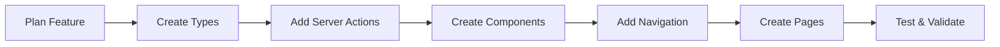
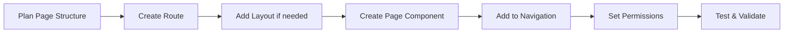

# Adding New Features & Pages Guide

This comprehensive guide explains how to extend the Next.js starter template with new functionality while maintaining consistency and best practices.

## Adding New Features

### 🎯 Feature Development Workflow



### 🏗 Step-by-Step: Adding a User Management Feature

Let's walk through adding a complete user management feature with CRUD operations, data tables, and forms.

#### Step 1: Define Types

Create type definitions in `src/types/user.ts`:

```typescript
// src/types/user.ts
export interface User {
  id: string;
  email: string;
  fullName: string;
  role: string;
  department: string;
  isActive: boolean;
  createdAt: string;
  updatedAt: string;
}

export interface CreateUserData {
  email: string;
  fullName: string;
  role: string;
  department: string;
  password: string;
}

export interface UpdateUserData {
  fullName?: string;
  role?: string;
  department?: string;
  isActive?: boolean;
}

// For data table configuration
export interface UserTableFilters {
  role?: string;
  department?: string;
  isActive?: boolean;
  search?: string;
}
```

#### Step 2: Create Server Actions

Add server actions in `src/actions/user-actions.ts`:

```typescript
// src/actions/user-actions.ts
'use server';

import { auth } from '@/auth';
import { apiInstance } from './instance';
import { User, CreateUserData, UpdateUserData } from '@/types/user';
import { revalidatePath } from 'next/cache';

export async function getUsers(params?: {
  page?: number;
  limit?: number;
  search?: string;
  role?: string;
  department?: string;
}) {
  const session = await auth();

  try {
    const response = await apiInstance.get('/users', {
      params,
      headers: {
        Authorization: `Bearer ${session?.accessToken}`
      }
    });

    return {
      success: true,
      data: response.data.users,
      total: response.data.total,
      page: response.data.page
    };
  } catch (error) {
    return {
      success: false,
      error: 'Failed to fetch users'
    };
  }
}

export async function createUser(data: CreateUserData) {
  const session = await auth();

  try {
    const response = await apiInstance.post('/users', data, {
      headers: {
        Authorization: `Bearer ${session?.accessToken}`
      }
    });

    revalidatePath('/dashboard/users');

    return {
      success: true,
      data: response.data
    };
  } catch (error) {
    return {
      success: false,
      error: 'Failed to create user'
    };
  }
}

export async function updateUser(id: string, data: UpdateUserData) {
  const session = await auth();

  try {
    const response = await apiInstance.put(`/users/${id}`, data, {
      headers: {
        Authorization: `Bearer ${session?.accessToken}`
      }
    });

    revalidatePath('/dashboard/users');

    return {
      success: true,
      data: response.data
    };
  } catch (error) {
    return {
      success: false,
      error: 'Failed to update user'
    };
  }
}

export async function deleteUser(id: string) {
  const session = await auth();

  try {
    await apiInstance.delete(`/users/${id}`, {
      headers: {
        Authorization: `Bearer ${session?.accessToken}`
      }
    });

    revalidatePath('/dashboard/users');

    return {
      success: true
    };
  } catch (error) {
    return {
      success: false,
      error: 'Failed to delete user'
    };
  }
}
```

#### Step 3: Create Form Components

Create user form in `src/components/users/user-form.tsx`:

```typescript
// src/components/users/user-form.tsx
'use client';

import { zodResolver } from '@hookform/resolvers/zod';
import { useForm } from 'react-hook-form';
import * as z from 'zod';
import { Button } from '@/components/ui/button';
import { Form } from '@/components/ui/form';
import { FormInput } from '@/components/forms/form-input';
import { FormSelect } from '@/components/forms/form-select';
import { createUser, updateUser } from '@/actions/user-actions';
import { toast } from 'sonner';

const userSchema = z.object({
  email: z.string().email('Invalid email address'),
  fullName: z.string().min(2, 'Full name must be at least 2 characters'),
  role: z.string().min(1, 'Role is required'),
  department: z.string().min(1, 'Department is required'),
  password: z.string().min(6, 'Password must be at least 6 characters')
});

type UserFormData = z.infer<typeof userSchema>;

interface UserFormProps {
  user?: User;
  onSuccess?: () => void;
}

export function UserForm({ user, onSuccess }: UserFormProps) {
  const form = useForm<UserFormData>({
    resolver: zodResolver(userSchema),
    defaultValues: {
      email: user?.email || '',
      fullName: user?.fullName || '',
      role: user?.role || '',
      department: user?.department || '',
      password: ''
    }
  });

  const onSubmit = async (data: UserFormData) => {
    const result = user
      ? await updateUser(user.id, data)
      : await createUser(data);

    if (result.success) {
      toast.success(user ? 'User updated successfully' : 'User created successfully');
      form.reset();
      onSuccess?.();
    } else {
      toast.error(result.error);
    }
  };

  return (
    <Form {...form}>
      <form onSubmit={form.handleSubmit(onSubmit)} className="space-y-4">
        <FormInput
          control={form.control}
          name="email"
          label="Email"
          placeholder="user@example.com"
        />

        <FormInput
          control={form.control}
          name="fullName"
          label="Full Name"
          placeholder="John Doe"
        />

        <FormSelect
          control={form.control}
          name="role"
          label="Role"
          placeholder="Select role"
          options={[
            { label: 'Admin', value: 'admin' },
            { label: 'Manager', value: 'manager' },
            { label: 'User', value: 'user' }
          ]}
        />

        <FormSelect
          control={form.control}
          name="department"
          label="Department"
          placeholder="Select department"
          options={[
            { label: 'IT', value: 'it' },
            { label: 'HR', value: 'hr' },
            { label: 'Finance', value: 'finance' }
          ]}
        />

        {!user && (
          <FormInput
            control={form.control}
            name="password"
            label="Password"
            type="password"
            placeholder="Enter password"
          />
        )}

        <Button type="submit" disabled={form.formState.isSubmitting}>
          {form.formState.isSubmitting
            ? (user ? 'Updating...' : 'Creating...')
            : (user ? 'Update User' : 'Create User')
          }
        </Button>
      </form>
    </Form>
  );
}
```

#### Step 4: Create Data Table

Create user table in `src/components/users/user-table.tsx`:

```typescript
// src/components/users/user-table.tsx
'use client';

import { DataTable } from '@/components/ui/data-table';
import { ColumnDef } from '@tanstack/react-table';
import { User } from '@/types/user';
import { Badge } from '@/components/ui/badge';
import { Button } from '@/components/ui/button';
import { MoreHorizontal, Pencil, Trash } from 'lucide-react';
import {
  DropdownMenu,
  DropdownMenuContent,
  DropdownMenuItem,
  DropdownMenuTrigger,
} from '@/components/ui/dropdown-menu';
import { deleteUser } from '@/actions/user-actions';
import { toast } from 'sonner';

interface UserTableProps {
  data: User[];
  totalCount: number;
  onEdit: (user: User) => void;
}

export function UserTable({ data, totalCount, onEdit }: UserTableProps) {
  const handleDelete = async (id: string) => {
    if (confirm('Are you sure you want to delete this user?')) {
      const result = await deleteUser(id);
      if (result.success) {
        toast.success('User deleted successfully');
      } else {
        toast.error(result.error);
      }
    }
  };

  const columns: ColumnDef<User>[] = [
    {
      accessorKey: 'fullName',
      header: 'Name',
    },
    {
      accessorKey: 'email',
      header: 'Email',
    },
    {
      accessorKey: 'role',
      header: 'Role',
      cell: ({ row }) => {
        const role = row.getValue('role') as string;
        return (
          <Badge variant={role === 'admin' ? 'destructive' : 'secondary'}>
            {role}
          </Badge>
        );
      },
    },
    {
      accessorKey: 'department',
      header: 'Department',
    },
    {
      accessorKey: 'isActive',
      header: 'Status',
      cell: ({ row }) => {
        const isActive = row.getValue('isActive') as boolean;
        return (
          <Badge variant={isActive ? 'default' : 'outline'}>
            {isActive ? 'Active' : 'Inactive'}
          </Badge>
        );
      },
    },
    {
      id: 'actions',
      header: 'Actions',
      cell: ({ row }) => {
        const user = row.original;

        return (
          <DropdownMenu>
            <DropdownMenuTrigger asChild>
              <Button variant="ghost" className="h-8 w-8 p-0">
                <MoreHorizontal className="h-4 w-4" />
              </Button>
            </DropdownMenuTrigger>
            <DropdownMenuContent align="end">
              <DropdownMenuItem onClick={() => onEdit(user)}>
                <Pencil className="mr-2 h-4 w-4" />
                Edit
              </DropdownMenuItem>
              <DropdownMenuItem
                onClick={() => handleDelete(user.id)}
                className="text-destructive"
              >
                <Trash className="mr-2 h-4 w-4" />
                Delete
              </DropdownMenuItem>
            </DropdownMenuContent>
          </DropdownMenu>
        );
      },
    },
  ];

  return (
    <DataTable
      columns={columns}
      data={data}
      totalCount={totalCount}
      searchKey="search"
      searchPlaceholder="Search users..."
      filterableColumns={[
        {
          id: 'role',
          title: 'Role',
          options: [
            { label: 'Admin', value: 'admin' },
            { label: 'Manager', value: 'manager' },
            { label: 'User', value: 'user' }
          ]
        },
        {
          id: 'department',
          title: 'Department',
          options: [
            { label: 'IT', value: 'it' },
            { label: 'HR', value: 'hr' },
            { label: 'Finance', value: 'finance' }
          ]
        }
      ]}
    />
  );
}
```

#### Step 5: Add Navigation

Update `src/config/nav-config.ts`:

```typescript
export const navItems: NavItem[] = [
  // ... existing items
  {
    title: 'User Management',
    url: '/dashboard/users',
    icon: 'users',
    shortcut: ['u', 'm'],
    items: [],
    access: {
      permission: 'manage:users'
    }
  }
  // ... rest of items
];
```

#### Step 6: Create the Page

Create `src/app/dashboard/users/page.tsx`:

```typescript
// src/app/dashboard/users/page.tsx
import { Suspense } from 'react';
import { UsersContent } from './users-content';
import { PageContainer } from '@/components/layout/page-container';
import { Breadcrumb } from '@/components/breadcrumbs';

export default function UsersPage() {
  return (
    <PageContainer>
      <Breadcrumb />
      <Suspense fallback={<div>Loading...</div>}>
        <UsersContent />
      </Suspense>
    </PageContainer>
  );
}
```

Create `src/app/dashboard/users/users-content.tsx`:

```typescript
// src/app/dashboard/users/users-content.tsx
'use client';

import { useState, useEffect } from 'react';
import { UserTable } from '@/components/users/user-table';
import { UserForm } from '@/components/users/user-form';
import { Button } from '@/components/ui/button';
import { Dialog, DialogContent, DialogHeader, DialogTitle } from '@/components/ui/dialog';
import { Card, CardContent, CardHeader, CardTitle } from '@/components/ui/card';
import { Plus } from 'lucide-react';
import { getUsers } from '@/actions/user-actions';
import { User } from '@/types/user';
import { useSearchParams } from 'next/navigation';

export function UsersContent() {
  const [users, setUsers] = useState<User[]>([]);
  const [totalCount, setTotalCount] = useState(0);
  const [loading, setLoading] = useState(true);
  const [isDialogOpen, setIsDialogOpen] = useState(false);
  const [editingUser, setEditingUser] = useState<User | null>(null);

  const searchParams = useSearchParams();

  const loadUsers = async () => {
    setLoading(true);
    const page = Number(searchParams.get('page')) || 1;
    const search = searchParams.get('search') || '';
    const role = searchParams.get('role') || '';
    const department = searchParams.get('department') || '';

    const result = await getUsers({
      page,
      search,
      role,
      department
    });

    if (result.success) {
      setUsers(result.data);
      setTotalCount(result.total);
    }
    setLoading(false);
  };

  useEffect(() => {
    loadUsers();
  }, [searchParams]);

  const handleEdit = (user: User) => {
    setEditingUser(user);
    setIsDialogOpen(true);
  };

  const handleCloseDialog = () => {
    setIsDialogOpen(false);
    setEditingUser(null);
    loadUsers(); // Refresh data
  };

  if (loading) {
    return <div>Loading users...</div>;
  }

  return (
    <div className="space-y-4">
      <div className="flex justify-between items-center">
        <h1 className="text-3xl font-bold">User Management</h1>
        <Button onClick={() => setIsDialogOpen(true)}>
          <Plus className="mr-2 h-4 w-4" />
          Add User
        </Button>
      </div>

      <Card>
        <CardHeader>
          <CardTitle>Users</CardTitle>
        </CardHeader>
        <CardContent>
          <UserTable
            data={users}
            totalCount={totalCount}
            onEdit={handleEdit}
          />
        </CardContent>
      </Card>

      <Dialog open={isDialogOpen} onOpenChange={setIsDialogOpen}>
        <DialogContent>
          <DialogHeader>
            <DialogTitle>
              {editingUser ? 'Edit User' : 'Create New User'}
            </DialogTitle>
          </DialogHeader>
          <UserForm
            user={editingUser}
            onSuccess={handleCloseDialog}
          />
        </DialogContent>
      </Dialog>
    </div>
  );
}
```

## Adding New Pages

### 🎯 Page Development Workflow



### 📄 Simple Page Example: Reports Dashboard

#### Step 1: Create the Page Route

Create `src/app/dashboard/reports/page.tsx`:

```typescript
// src/app/dashboard/reports/page.tsx
import { Suspense } from 'react';
import { PageContainer } from '@/components/layout/page-container';
import { Breadcrumb } from '@/components/breadcrumbs';
import { ReportsContent } from './reports-content';
import { auth } from '@/auth';
import { redirect } from 'next/navigation';

export const metadata = {
  title: 'Reports Dashboard',
  description: 'View and generate reports'
};

export default async function ReportsPage() {
  const session = await auth();

  // Page-level permission check
  const hasReportsAccess = session?.user?.permissions?.includes('view:reports');

  if (!hasReportsAccess) {
    redirect('/dashboard/unauthorized');
  }

  return (
    <PageContainer>
      <Breadcrumb />
      <Suspense fallback={<div>Loading reports...</div>}>
        <ReportsContent />
      </Suspense>
    </PageContainer>
  );
}
```

#### Step 2: Create Page Content Component

Create `src/app/dashboard/reports/reports-content.tsx`:

```typescript
// src/app/dashboard/reports/reports-content.tsx
'use client';

import { Card, CardContent, CardHeader, CardTitle } from '@/components/ui/card';
import { Button } from '@/components/ui/button';
import { Download, Calendar, BarChart } from 'lucide-react';
import { useState } from 'react';

export function ReportsContent() {
  const [selectedReport, setSelectedReport] = useState<string>('');

  const reportTypes = [
    { id: 'user-activity', name: 'User Activity Report', icon: BarChart },
    { id: 'sales-summary', name: 'Sales Summary', icon: Calendar },
    { id: 'system-logs', name: 'System Logs', icon: Download }
  ];

  return (
    <div className="space-y-6">
      <div className="flex justify-between items-center">
        <div>
          <h1 className="text-3xl font-bold">Reports Dashboard</h1>
          <p className="text-muted-foreground">Generate and download reports</p>
        </div>
        <Button>
          <Download className="mr-2 h-4 w-4" />
          Export All
        </Button>
      </div>

      <div className="grid grid-cols-1 md:grid-cols-2 lg:grid-cols-3 gap-6">
        {reportTypes.map((report) => (
          <Card key={report.id} className="cursor-pointer hover:shadow-lg transition-shadow">
            <CardHeader>
              <CardTitle className="flex items-center gap-2">
                <report.icon className="h-5 w-5" />
                {report.name}
              </CardTitle>
            </CardHeader>
            <CardContent>
              <p className="text-sm text-muted-foreground mb-4">
                Generate comprehensive {report.name.toLowerCase()} with detailed insights.
              </p>
              <Button
                variant="outline"
                className="w-full"
                onClick={() => setSelectedReport(report.id)}
              >
                Generate Report
              </Button>
            </CardContent>
          </Card>
        ))}
      </div>

      {/* Recent Reports Section */}
      <Card>
        <CardHeader>
          <CardTitle>Recent Reports</CardTitle>
        </CardHeader>
        <CardContent>
          <div className="space-y-4">
            <div className="flex items-center justify-between p-4 border rounded-lg">
              <div>
                <h4 className="font-medium">User Activity Report - January 2024</h4>
                <p className="text-sm text-muted-foreground">Generated on Jan 31, 2024</p>
              </div>
              <Button variant="ghost" size="sm">
                <Download className="h-4 w-4" />
              </Button>
            </div>
            <div className="flex items-center justify-between p-4 border rounded-lg">
              <div>
                <h4 className="font-medium">Sales Summary - Q4 2023</h4>
                <p className="text-sm text-muted-foreground">Generated on Dec 31, 2023</p>
              </div>
              <Button variant="ghost" size="sm">
                <Download className="h-4 w-4" />
              </Button>
            </div>
          </div>
        </CardContent>
      </Card>
    </div>
  );
}
```

#### Step 3: Add to Navigation

Update `src/config/nav-config.ts`:

```typescript
export const navItems: NavItem[] = [
  // ... existing items
  {
    title: 'Reports',
    url: '/dashboard/reports',
    icon: 'chart',
    shortcut: ['r', 'p'],
    items: [],
    access: {
      permission: 'view:reports'
    }
  }
  // ... rest of items
];
```

### 🗂 Complex Page Example: Settings with Nested Routes

#### Step 1: Create Layout for Settings Section

Create `src/app/dashboard/settings/layout.tsx`:

```typescript
// src/app/dashboard/settings/layout.tsx
import { SettingsNav } from './settings-nav';

export default function SettingsLayout({
  children
}: {
  children: React.ReactNode;
}) {
  return (
    <div className="flex min-h-screen">
      <div className="w-64 border-r bg-background/95 backdrop-blur supports-[backdrop-filter]:bg-background/60">
        <SettingsNav />
      </div>
      <div className="flex-1 p-8">
        {children}
      </div>
    </div>
  );
}
```

#### Step 2: Create Settings Navigation

Create `src/app/dashboard/settings/settings-nav.tsx`:

```typescript
// src/app/dashboard/settings/settings-nav.tsx
'use client';

import Link from 'next/link';
import { usePathname } from 'next/navigation';
import { cn } from '@/lib/utils';
import { Button } from '@/components/ui/button';

const settingsLinks = [
  {
    title: 'General',
    href: '/dashboard/settings',
    description: 'Manage general application settings'
  },
  {
    title: 'Profile',
    href: '/dashboard/settings/profile',
    description: 'Update your personal information'
  },
  {
    title: 'Security',
    href: '/dashboard/settings/security',
    description: 'Password and security settings'
  },
  {
    title: 'Notifications',
    href: '/dashboard/settings/notifications',
    description: 'Configure notification preferences'
  },
  {
    title: 'API Keys',
    href: '/dashboard/settings/api-keys',
    description: 'Manage API access keys',
    permission: 'manage:api_keys'
  }
];

export function SettingsNav() {
  const pathname = usePathname();

  return (
    <nav className="p-6 space-y-2">
      <h2 className="text-lg font-semibold mb-4">Settings</h2>
      {settingsLinks.map((link) => (
        <Link key={link.href} href={link.href}>
          <Button
            variant={pathname === link.href ? "secondary" : "ghost"}
            className={cn(
              "w-full justify-start text-left",
              pathname === link.href && "bg-secondary"
            )}
          >
            <div>
              <div className="font-medium">{link.title}</div>
              <div className="text-xs text-muted-foreground">
                {link.description}
              </div>
            </div>
          </Button>
        </Link>
      ))}
    </nav>
  );
}
```

#### Step 3: Create Individual Setting Pages

Create `src/app/dashboard/settings/page.tsx` (General Settings):

```typescript
// src/app/dashboard/settings/page.tsx
import { Card, CardContent, CardHeader, CardTitle } from '@/components/ui/card';
import { GeneralSettingsForm } from './general-settings-form';

export default function GeneralSettingsPage() {
  return (
    <div className="space-y-6">
      <div>
        <h1 className="text-3xl font-bold">General Settings</h1>
        <p className="text-muted-foreground">
          Manage your application preferences and general settings.
        </p>
      </div>

      <Card>
        <CardHeader>
          <CardTitle>Application Settings</CardTitle>
        </CardHeader>
        <CardContent>
          <GeneralSettingsForm />
        </CardContent>
      </Card>
    </div>
  );
}
```

Create `src/app/dashboard/settings/profile/page.tsx`:

```typescript
// src/app/dashboard/settings/profile/page.tsx
import { Card, CardContent, CardHeader, CardTitle } from '@/components/ui/card';
import { ProfileSettingsForm } from './profile-settings-form';
import { auth } from '@/auth';

export default async function ProfileSettingsPage() {
  const session = await auth();

  return (
    <div className="space-y-6">
      <div>
        <h1 className="text-3xl font-bold">Profile Settings</h1>
        <p className="text-muted-foreground">
          Update your personal information and preferences.
        </p>
      </div>

      <Card>
        <CardHeader>
          <CardTitle>Personal Information</CardTitle>
        </CardHeader>
        <CardContent>
          <ProfileSettingsForm user={session?.user} />
        </CardContent>
      </Card>
    </div>
  );
}
```

### 🎯 Page Development Checklist

When creating any new page, ensure you:

- [ ] **Page Structure**: Clear layout and component organization
- [ ] **Metadata**: Set appropriate title and description
- [ ] **Breadcrumbs**: Add breadcrumb navigation
- [ ] **Loading States**: Implement proper loading UI with Suspense
- [ ] **Error Boundaries**: Handle errors gracefully
- [ ] **Permissions**: Add appropriate access control
- [ ] **Navigation**: Add to nav-config with proper permissions
- [ ] **Responsive Design**: Ensure mobile-friendly layouts
- [ ] **SEO**: Add proper meta tags and structured data
- [ ] **Performance**: Optimize for Core Web Vitals

### 🔄 Common Page Patterns

#### Landing Page Pattern

```typescript
// For pages that show overview/dashboard information
export default function DashboardPage() {
  return (
    <PageContainer>
      <div className="grid grid-cols-1 md:grid-cols-2 lg:grid-cols-4 gap-6">
        <StatCard title="Total Users" value="1,234" />
        <StatCard title="Revenue" value="$12,345" />
        <StatCard title="Orders" value="456" />
        <StatCard title="Growth" value="+12%" />
      </div>
    </PageContainer>
  );
}
```

#### List/Table Page Pattern

```typescript
// For pages showing data in table format
export default function UsersListPage() {
  return (
    <PageContainer>
      <div className="flex justify-between items-center mb-6">
        <h1 className="text-3xl font-bold">Users</h1>
        <Button>Add User</Button>
      </div>
      <UsersTable />
    </PageContainer>
  );
}
```

#### Form Page Pattern

```typescript
// For pages with primary form interface
export default function CreateUserPage() {
  return (
    <PageContainer>
      <Card>
        <CardHeader>
          <CardTitle>Create New User</CardTitle>
        </CardHeader>
        <CardContent>
          <UserForm />
        </CardContent>
      </Card>
    </PageContainer>
  );
}
```

#### Detail/Profile Page Pattern

```typescript
// For pages showing detailed information
export default function UserDetailPage({ params }: { params: { id: string } }) {
  return (
    <PageContainer>
      <div className="grid grid-cols-1 lg:grid-cols-3 gap-6">
        <div className="lg:col-span-2">
          <UserProfile userId={params.id} />
        </div>
        <div>
          <UserActions userId={params.id} />
        </div>
      </div>
    </PageContainer>
  );
}
```

## Feature Development Checklist

When adding any new feature, ensure you:

- [ ] **Define Types**: Clear TypeScript interfaces
- [ ] **Server Actions**: API integration with error handling
- [ ] **Form Validation**: Zod schemas for data validation
- [ ] **Components**: Reusable, accessible UI components
- [ ] **Navigation**: Add to nav-config with proper permissions
- [ ] **Error Handling**: Proper error states and user feedback
- [ ] **Loading States**: Show loading indicators during operations
- [ ] **Permissions**: Implement access control where needed
- [ ] **Revalidation**: Update cached data after mutations
- [ ] **Testing**: Test all CRUD operations and edge cases

## Common Patterns

### API Error Handling

```typescript
try {
  const response = await apiInstance.get('/endpoint');
  return { success: true, data: response.data };
} catch (error) {
  console.error('API Error:', error);
  return {
    success: false,
    error: error.response?.data?.message || 'Something went wrong'
  };
}
```

### Optimistic Updates

```typescript
// Update UI immediately, then sync with server
const optimisticUpdate = (id: string, newData: Partial<Item>) => {
  setItems((prev) =>
    prev.map((item) => (item.id === id ? { ...item, ...newData } : item))
  );

  // Then sync with server
  updateItemOnServer(id, newData);
};
```

### Form Reset Pattern

```typescript
const onSubmit = async (data: FormData) => {
  const result = await submitData(data);

  if (result.success) {
    form.reset(); // Reset form state
    onSuccess?.(); // Close dialog, refresh data, etc.
    toast.success('Operation successful');
  } else {
    toast.error(result.error);
  }
};
```
