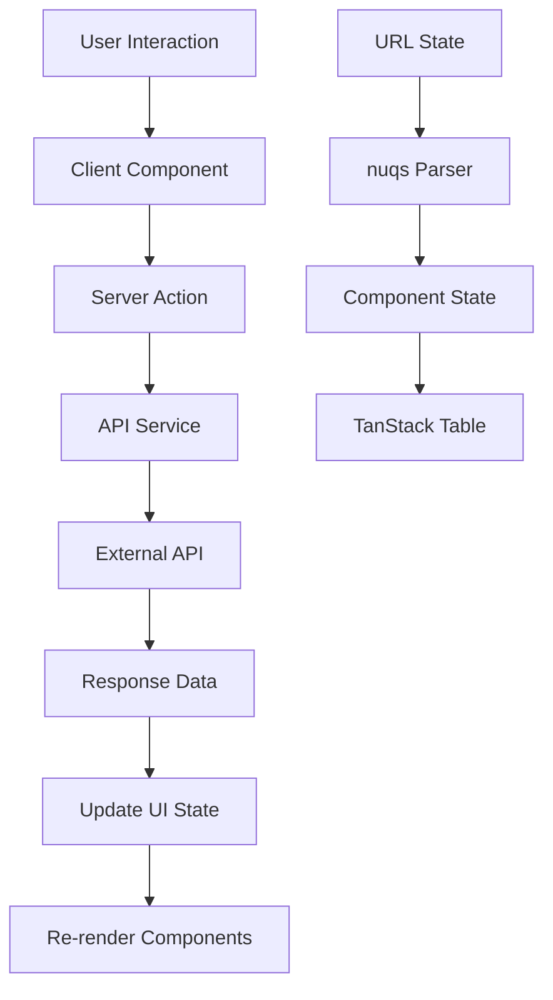

# Next.js Starter Template Documentation

A comprehensive admin dashboard starter template built with Next.js 16, featuring authentication, role-based access control, server actions, TanStack tables, and more. This documentation provides everything you need to understand, use, and extend this template.

## Table of Contents

1. [Overview](#overview)
2. [Getting Started](#getting-started)
3. [Project Architecture](#project-architecture)
4. [Authentication System](#authentication-system)
5. [Role-Based Access Control](#role-based-access-control)
6. [Adding New Features](#adding-new-features)
7. [Adding New Pages](#adding-new-pages)
8. [Components & UI](#components--ui)
9. [Forms & Data Management](#forms--data-management)
10. [Server Actions](#server-actions)
11. [TanStack Table](#tanstack-table)
12. [URL State Management (nuqs)](#url-state-management-nuqs)
13. [Development Workflow](#development-workflow)
14. [Deployment](#deployment)
15. [Best Practices](#best-practices)
16. [Troubleshooting](#troubleshooting)

## Overview

This is a production-ready **admin dashboard starter template** that provides a complete foundation for building modern web applications. Built with the latest technologies and best practices, it offers everything you need to kickstart your next project.

### 🎯 What You Get

- **Complete Authentication System**: JWT-based auth with NextAuth.js v5
- **Modern UI/UX**: Beautiful, responsive dashboard with Shadcn UI components
- **Advanced Data Tables**: Server-side pagination, filtering, and sorting
- **Role-Based Access Control**: Granular permission system for navigation and pages
- **Form Management**: Type-safe forms with validation using React Hook Form + Zod
- **State Management**: URL state management with nuqs + Zustand for global state
- **Command Interface**: Cmd+K interface for quick navigation
- **Developer Experience**: TypeScript, ESLint, Prettier, Husky pre-commit hooks

### 🛠 Technology Stack

| Category             | Technology                | Purpose                               |
| -------------------- | ------------------------- | ------------------------------------- |
| **Framework**        | Next.js 16 (App Router)   | React framework with SSR/SSG          |
| **Language**         | TypeScript                | Type-safe JavaScript                  |
| **Authentication**   | NextAuth.js v5            | Secure authentication system          |
| **Styling**          | Tailwind CSS v4           | Utility-first CSS framework           |
| **UI Components**    | Shadcn UI                 | Pre-built accessible components       |
| **Forms**            | React Hook Form + Zod     | Form handling with validation         |
| **Tables**           | TanStack Table            | Powerful data tables                  |
| **State Management** | Zustand + nuqs            | Global state + URL state              |
| **Commands**         | kbar                      | Command+K interface                   |
| **Code Quality**     | ESLint + Prettier + Husky | Linting, formatting, pre-commit hooks |

## Getting Started

### 📋 Prerequisites

Before you begin, ensure you have:

- **Node.js 18+** (recommended: Node.js 20+)
- **pnpm** (recommended) or npm/yarn
- **Git** for version control
- **Code Editor** (VS Code recommended)

### 🚀 Quick Start (5 minutes)

#### 1. Clone and Install

```bash
# Clone the repository
git clone <your-repository-url>
cd next-js-starter-template

# Install dependencies (using pnpm - recommended)
pnpm install

# Alternative with npm
# npm install
```

#### 2. Environment Setup

Create your environment file:

```bash
cp .env.example.txt .env.local
```

Configure your environment variables in `.env.local`:

```bash
# Authentication
AUTH_SECRET=your-super-secret-key-here
NEXTAUTH_URL=http://localhost:3000

# API Endpoints (configure based on your backend)
AUTH_SERVICE=https://your-auth-api.com/api
COMMON_SERVICE=https://your-common-api.com/api

# Optional: Database URL if using database auth
DATABASE_URL=your-database-connection-string
```

#### 3. Start Development

```bash
# Start the development server
pnpm dev

# Open your browser
# Visit: http://localhost:3000
```

#### 4. First Login

The template comes with demo authentication. You can:

- Use the login page at `http://localhost:3000`
- Check `src/components/auth/login-page.tsx` for demo credentials
- Or integrate with your own authentication service

### 📁 Project Structure Deep Dive

```
next-js-starter-template/
├── public/                          # Static assets
│   ├── icons/                       # Icon files
│   └── images/                      # Image assets
├── src/
│   ├── app/                         # Next.js App Router
│   │   ├── (auth)/                  # Auth route group
│   │   ├── dashboard/               # Dashboard pages
│   │   │   ├── layout.tsx           # Dashboard layout
│   │   │   ├── page.tsx            # Dashboard home
│   │   │   ├── master/             # Master data pages
│   │   │   └── overview/           # Overview pages
│   │   ├── api/                    # API routes
│   │   │   └── auth/               # NextAuth API routes
│   │   ├── globals.css             # Global styles
│   │   ├── layout.tsx              # Root layout
│   │   └── page.tsx                # Home page
│   ├── actions/                    # Server Actions
│   │   ├── instance.ts             # API instance configuration
│   │   └── common/                 # Common server actions
│   ├── components/                 # Reusable components
│   │   ├── auth/                   # Authentication components
│   │   ├── forms/                  # Form components
│   │   ├── layout/                 # Layout components
│   │   ├── ui/                     # Shadcn UI components
│   │   └── modal/                  # Modal components
│   ├── config/                     # Configuration files
│   │   ├── nav-config.ts           # Navigation configuration
│   │   └── data-table.ts           # Table configuration
│   ├── hooks/                      # Custom React hooks
│   ├── lib/                        # Utility functions
│   │   ├── utils.ts                # Common utilities
│   │   └── auth.ts                 # Auth utilities
│   └── types/                      # TypeScript type definitions
├── types/                          # Global type definitions
├── .env.example.txt               # Environment variables template
├── components.json                # Shadcn UI configuration
├── tsconfig.json                 # TypeScript configuration
└── package.json                  # Dependencies and scripts
```

### 🔧 Development Scripts

```bash
# Development
pnpm dev                    # Start dev server with hot reload
pnpm build                  # Build for production
pnpm start                  # Start production server
pnpm lint                   # Run ESLint
pnpm lint:fix              # Fix linting issues
pnpm format                # Format code with Prettier
```

## Project Architecture

### 🏗 Architectural Principles

This template follows modern React and Next.js architectural patterns:

#### 1. **Server-First Architecture**

- **Server Components**: Default for all components, better performance
- **Server Actions**: Handle form submissions and data mutations
- **Streaming**: Progressive loading with Suspense boundaries

#### 2. **Feature-Based Organization**

- Components grouped by feature, not by type
- Co-located related files (components, hooks, types)
- Easy to find and modify related code

#### 3. **Type-Safe Development**

- Full TypeScript coverage
- Strict type checking
- Shared type definitions

### 📂 Key Directories Explained

#### `/src/app` - App Router (Pages & Layouts)

```
app/
├── layout.tsx              # Root layout (global providers, fonts, themes)
├── page.tsx                # Home/landing page
├── dashboard/              # Dashboard section
│   ├── layout.tsx          # Dashboard layout (sidebar, navigation)
│   ├── page.tsx           # Dashboard overview
│   └── master/            # Master data management
│       └── dzongkhag/     # Example: Location management
└── api/                   # API endpoints
    └── auth/              # NextAuth.js API routes
```

#### `/src/components` - Reusable Components

```
components/
├── auth/                  # Authentication related
│   ├── login-page.tsx     # Login form component
│   └── login-button.tsx   # Login/logout button
├── forms/                 # Form components
│   ├── form-input.tsx     # Text input with validation
│   ├── form-select.tsx    # Select dropdown
│   └── demo-form.tsx      # Example form implementation
├── layout/                # Layout components
│   ├── app-sidebar.tsx    # Main navigation sidebar
│   ├── header.tsx         # Top header with user menu
│   └── providers.tsx      # Global context providers
├── ui/                    # Shadcn UI components (auto-generated)
│   ├── button.tsx         # Button component
│   ├── input.tsx          # Input component
│   └── ...               # Other UI primitives
└── kbar/                 # Command+K interface
    ├── index.tsx          # Main kbar setup
    └── result-item.tsx    # Search result styling
```

#### `/src/actions` - Server Actions

```
actions/
├── instance.ts            # Axios instance configuration
└── common/               # Shared server actions
    └── dzongkhag-actions.ts  # Example: Location data actions
```

#### `/src/config` - Configuration Files

```
config/
├── nav-config.ts         # Navigation structure & permissions
├── data-table.ts         # Table configuration
└── infoconfig.ts         # Info sidebar configuration
```

### 🔄 Data Flow Architecture



#### Key Concepts:

1. **Server Actions**: Handle form submissions and data mutations
2. **URL State**: Table filters, pagination stored in URL
3. **Optimistic Updates**: Immediate UI feedback, then sync with server
4. **Type Safety**: End-to-end TypeScript from API to UI

## Authentication System

### 🤔 Why Use This Authentication System?

The template uses **NextAuth.js v5** because it provides:

- **Industry Standard Security**: Built-in protection against CSRF, XSS, and other attacks
- **JWT Strategy**: Stateless authentication that scales well
- **Flexible Session Management**: Support for both short and extended sessions
- **Easy Integration**: Works seamlessly with Next.js App Router
- **Token Refresh**: Automatic token renewal without user interruption
- **Multiple Providers**: Can easily add OAuth providers (Google, GitHub, etc.)

### 🚀 How It Works

1. **User logs in** → Credentials verified against your API
2. **JWT tokens created** → Access token (short-lived) + Refresh token (long-lived)
3. **Session stored** → Client receives secure HTTP-only cookies
4. **Auto-refresh** → Tokens renewed 5 minutes before expiry
5. **Route protection** → Middleware checks authentication on protected routes

### 🔧 Configuration Files

| File                                           | Purpose                | Key Features                                   |
| ---------------------------------------------- | ---------------------- | ---------------------------------------------- |
| [`src/auth.config.ts`](src/auth.config.ts)     | NextAuth configuration | JWT strategy, session callbacks, token refresh |
| [`src/auth.ts`](src/auth.ts)                   | Auth instance          | Main auth object for server components         |
| [`src/proxy.ts`](src/proxy.ts)                 | Middleware             | Route protection, redirects                    |
| [`types/next-auth.d.ts`](types/next-auth.d.ts) | TypeScript definitions | Extended session and user types                |

### 🚀 Core Features

#### 1. **JWT Strategy with Smart Token Refresh**

```typescript
// Automatic token refresh 5 minutes before expiry
// No user interruption during active sessions
const TOKEN_REFRESH_BUFFER = 5 * 60; // 5 minutes

// Session duration based on "Remember Me"
const SESSION_MAX_AGE_REMEMBER = 7 * 24 * 60 * 60; // 7 days
const SESSION_MAX_AGE_DEFAULT = 24 * 60 * 60; // 24 hours
```

#### 2. **Flexible Session Management**

```typescript
// Short session (default): 24 hours
// Extended session (remember me): 7 days
// Automatic cleanup on expiry
```

#### 3. **Route Protection Middleware**

```typescript
// Automatic redirects:
// ❌ Unauthenticated + /dashboard/* → /login
// ✅ Authenticated + / → /dashboard
// 🔒 Role-based page access
```

### 💻 Usage Examples

#### Server Components (Recommended)

```typescript
// Get session in any server component
import { auth } from '@/auth';

export default async function DashboardPage() {
  const session = await auth();

  if (!session?.user) {
    redirect('/login');
  }

  return (
    <div>
      <h1>Welcome, {session.user.fullName}!</h1>
      {/* Use session.accessToken for API calls */}
    </div>
  );
}
```

#### Client Components

```typescript
'use client';
import { useSession } from 'next-auth/react';

export default function UserProfile() {
  const { data: session, status } = useSession();

  if (status === 'loading') return <div>Loading...</div>;
  if (!session) return <div>Please sign in</div>;

  return <div>Hello, {session.user.fullName}!</div>;
}
```

#### Login Implementation

```typescript
// src/components/auth/login-page.tsx
import { signIn } from 'next-auth/react';

const handleLogin = async (formData) => {
  const result = await signIn('credentials', {
    email: formData.email,
    password: formData.password,
    rememberMe: formData.rememberMe.toString(),
    redirect: false
  });

  if (result?.ok) {
    router.push('/dashboard');
  } else {
    // Handle login error
    setError('Invalid credentials');
  }
};
```

#### Logout Options

```typescript
// Server Action (recommended)
import { signOut } from '@/auth';
await signOut({ redirectTo: '/' });

// Client Component
import { signOut } from 'next-auth/react';
await signOut({ callbackUrl: '/' });
```

### 🔐 Session Data Structure

The session object contains:

```typescript
interface Session {
  user: {
    id: string;
    email: string;
    fullName: string;
    userType: string;
    permissions: string[];
    // ... other user fields
  };
  accessToken: string;
  refreshToken: string;
  expires: string;
}
```

### 🛡 Security Features

1. **CSRF Protection**: Built-in with NextAuth.js
2. **Secure Cookies**: HttpOnly, Secure, SameSite
3. **Token Rotation**: Refresh tokens rotated on each use
4. **Session Validation**: Automatic token validation
5. **Route Protection**: Middleware-based access control

## Role-Based Access Control (RBAC)

### 🤔 Why Use RBAC?

Role-Based Access Control is essential for any multi-user application because:

- **Security**: Prevents unauthorized access to sensitive features
- **Scalability**: Easy to manage permissions for hundreds of users
- **Compliance**: Meets enterprise security requirements
- **User Experience**: Users only see relevant features
- **Maintainability**: Centralized permission management

### 🚀 How It Works

1. **User Authentication** → User logs in and receives permissions in JWT
2. **Permission Check** → Navigation/components check user permissions
3. **Dynamic Filtering** → UI elements show/hide based on permissions
4. **Server Validation** → Server actions verify permissions before execution
5. **Route Protection** → Pages redirect unauthorized users

**Example Flow:**

```
User Login → JWT with permissions → Navigation filtered → Page access checked → Server actions validated
```

### 🎯 Key Features

- **Navigation Filtering**: Show/hide navigation items based on user permissions
- **Page Protection**: Restrict access to specific pages or sections
- **Flexible Permissions**: Support both string and object-based permission formats
- **Organizational Context**: Filter by user type, roles, and organizational membership
- **Client-Side Performance**: Fast navigation filtering without server round-trips

### 🔧 Configuration

#### Navigation Access Control

Edit [`src/config/nav-config.ts`](src/config/nav-config.ts) to configure navigation access:

```typescript
export const navItems: NavItem[] = [
  {
    title: 'Dashboard',
    url: '/dashboard/overview',
    icon: 'dashboard',
    items: []
    // No access control - visible to all authenticated users
  },
  {
    title: 'User Management',
    url: '/dashboard/users',
    icon: 'users',
    items: [],
    // String-based permission
    access: {
      permission: 'manage:users'
    }
  },
  {
    title: 'Analytics',
    url: '/dashboard/analytics',
    icon: 'chart',
    items: [],
    // Object-based permission with multiple conditions
    access: {
      permission: {
        resource: 'analytics',
        action: 'view'
      },
      userType: ['admin', 'manager'], // Multiple user types
      role: 'analyst' // Specific role requirement
    }
  },
  {
    title: 'Master Data',
    url: '#',
    icon: 'settings',
    items: [
      {
        title: 'Locations',
        url: '/dashboard/master/dzongkhag',
        access: {
          permission: 'manage:master_data'
        }
      },
      {
        title: 'Categories',
        url: '/dashboard/master/categories',
        access: {
          permission: ['read:categories', 'write:categories'] // Multiple permissions
        }
      }
    ]
  }
];
```

### 🛡 Permission Types

#### 1. **String Permissions**

```typescript
// Simple permission check
access: {
  permission: 'manage:users';
}

// Multiple permissions (user needs ANY of these)
access: {
  permission: ['read:reports', 'write:reports'];
}
```

#### 2. **Object Permissions**

```typescript
// Structured permission object
access: {
  permission: {
    resource: 'financial_data',
    action: 'view',
    scope: 'organization' // optional: additional context
  }
}
```

#### 3. **Combined Conditions**

```typescript
// User must have permission AND be admin/manager
access: {
  permission: 'sensitive:data',
  userType: ['admin', 'manager'],
  role: 'data_analyst'
}
```

### 💼 Implementation Examples

#### Page-Level Protection

```typescript
// src/app/dashboard/admin/page.tsx
import { auth } from '@/auth';
import { redirect } from 'next/navigation';
import { hasPermission } from '@/lib/permissions';

export default async function AdminPage() {
  const session = await auth();

  // Check if user has required permission
  if (!hasPermission(session.user, 'admin:access')) {
    redirect('/dashboard/unauthorized');
  }

  return (
    <div>
      <h1>Admin Panel</h1>
      {/* Admin-only content */}
    </div>
  );
}
```

#### Component-Level Access Control

```typescript
// src/components/admin-panel.tsx
import { useSession } from 'next-auth/react';
import { hasPermission } from '@/lib/permissions';

export function AdminPanel() {
  const { data: session } = useSession();

  if (!hasPermission(session?.user, 'admin:panel')) {
    return null; // Hide component
  }

  return (
    <div>
      {/* Admin panel content */}
      {hasPermission(session.user, 'delete:users') && (
        <button>Delete User</button>
      )}
    </div>
  );
}
```

#### Custom Permission Hook

```typescript
// src/hooks/use-permissions.ts
import { useSession } from 'next-auth/react';
import { hasPermission as checkPermission } from '@/lib/permissions';

export function usePermissions() {
  const { data: session } = useSession();

  const hasPermission = (permission: string | object) => {
    return checkPermission(session?.user, permission);
  };

  const hasAnyPermission = (permissions: string[]) => {
    return permissions.some(permission => hasPermission(permission));
  };

  const hasAllPermissions = (permissions: string[]) => {
    return permissions.every(permission => hasPermission(permission));
  };

  return {
    hasPermission,
    hasAnyPermission,
    hasAllPermissions,
    user: session?.user
  };
}

// Usage in components
export function UserActions() {
  const { hasPermission } = usePermissions();

  return (
    <div>
      {hasPermission('edit:user') && <EditButton />}
      {hasPermission('delete:user') && <DeleteButton />}
    </div>
  );
}
```

### 🎨 Navigation Filtering

The navigation automatically filters based on the current user's permissions:

```typescript
// src/components/layout/app-sidebar.tsx
// Navigation items are automatically filtered based on user session
// Items without matching permissions are hidden from the sidebar
```

### 🔧 Setting Up Permissions

#### 1. **Define Permission Structure**

Create a clear permission naming convention:

```typescript
// Action-based permissions
'create:users', 'read:users', 'update:users', 'delete:users';

// Feature-based permissions
'access:admin_panel', 'manage:billing', 'view:analytics';

// Hierarchical permissions
'admin:full_access', 'manager:team_access', 'user:basic_access';
```

#### 2. **Backend Integration**

Ensure your authentication service returns user permissions:

```typescript
// Expected user object from your auth API
{
  id: "user123",
  email: "user@example.com",
  fullName: "John Doe",
  userType: "admin",
  role: "manager",
  permissions: [
    "manage:users",
    "view:analytics",
    "admin:access"
  ]
}
```

#### 3. **Permission Management**

Consider implementing a permission management interface:

- Assign permissions to roles
- Assign roles to users
- Override permissions for specific users
- Organizational/team-based permissions

### 🚀 Best Practices

1. **Principle of Least Privilege**: Start with minimal permissions
2. **Consistent Naming**: Use clear, consistent permission naming
3. **Documentation**: Document what each permission grants access to
4. **Regular Audits**: Review and update permissions regularly
5. **Fallback Security**: Always implement server-side permission checks
   },
   {
   title: 'User Management',
   url: '/dashboard/users',
   icon: 'users',
   items: [],
   // Require organization membership
   access: { requireOrg: true }
   },
   {
   title: 'Admin Panel',
   url: '/dashboard/admin',
   icon: 'settings',
   items: [],
   // Require specific permission
   access: {
   requireOrg: true,
   permission: 'admin:panel:access'
   }
   },
   {
   title: 'Premium Features',
   url: '/dashboard/premium',
   icon: 'star',
   items: [],
   // Require specific plan or feature
   access: {
   plan: 'pro',
   feature: 'premium_access'
   }
   }
   ];

````

#### Access Control Properties

```typescript
interface PermissionCheck {
  permission?: string; // Specific permission required
  plan?: string; // Subscription plan required
  feature?: string; // Feature flag required
  role?: string; // User role required
  requireOrg?: boolean; // Organization membership required
}
````

### User Permissions Structure

#### User Object with Permissions

```typescript
// User session includes roles and permissions
interface User {
  id: string;
  fullName: string;
  roles: Array<{
    id: string;
    name: string;
    permissions: Array<{
      id: string;
      name: string;
    }>;
  }>;
  // Flexible ability format
  ability: Array<
    | string
    | {
        name: string;
        action: string;
        subject: string;
      }
  >;
}
```

#### Permission Examples

```typescript
// String format (recommended)
user.ability = [
  'read:users',
  'write:posts',
  'admin:panel:access',
  'org:teams:manage'
];

// Object format (legacy support)
user.ability = [
  {
    name: 'User Management',
    action: 'read',
    subject: 'users'
  },
  {
    name: 'Post Creation',
    action: 'write',
    subject: 'posts'
  }
];
```

### Page-Level Access Control

#### Using PageContainer

```tsx
// src/components/layout/page-container.tsx
import PageContainer from '@/components/layout/page-container';

export default function AdminPage() {
  const hasAdminAccess = checkUserPermission('admin:panel:access');

  return (
    <PageContainer
      access={hasAdminAccess}
      accessFallback={<div>You need admin privileges to access this page.</div>}
      pageTitle="Admin Panel"
      pageDescription="System administration"
    >
      {/* Page content only shown if access=true */}
      <AdminContent />
    </PageContainer>
  );
}
```

#### Custom Access Control Hook

```typescript
// Custom hook example
function usePermissions() {
  const { data: session } = useSession();

  const hasPermission = (permission: string) => {
    if (!session?.user?.ability) return false;

    return session.user.ability.some((ability) =>
      typeof ability === 'string'
        ? ability === permission
        : ability.name === permission
    );
  };

  const hasRole = (role: string) => {
    return session?.user?.roles?.some((r) => r.name === role);
  };

  return { hasPermission, hasRole };
}
```

### Implementation Examples

#### Conditional Navigation

```tsx
// Navigation filtering happens automatically via nav-config.ts
// But you can also do manual checks:

function NavItem({ item }) {
  const { hasPermission } = usePermissions();

  if (item.access?.permission && !hasPermission(item.access.permission)) {
    return null; // Don't render this nav item
  }

  return <a href={item.url}>{item.title}</a>;
}
```

#### Server-Side Access Control

```tsx
// app/admin/page.tsx
import { auth } from '@/auth';
import { redirect } from 'next/navigation';

export default async function AdminPage() {
  const session = await auth();

  const hasAdminAccess = session?.user?.ability?.includes('admin:panel:access');

  if (!hasAdminAccess) {
    redirect('/dashboard'); // or show 403 page
  }

  return <div>Admin content</div>;
}
```

## Adding New Features

### 🤔 Why Follow This Process?

Adding features systematically ensures:

- **Consistency**: All features follow the same patterns
- **Maintainability**: Code is organized and easy to modify
- **Type Safety**: Full TypeScript coverage from API to UI
- **Performance**: Proper caching and state management
- **Security**: Permission checks and validation at every level

### 🚀 How to Add Features (Quick Guide)

**5-Step Process:**

1. **Types** → Define TypeScript interfaces
2. **Server Actions** → Create API integration functions
3. **Components** → Build reusable UI components
4. **Navigation** → Add to nav-config with permissions
5. **Pages** → Create the actual pages that use everything

**Example - Adding User Management:**

```typescript
// 1. Types
interface User { id: string; name: string; email: string; }

// 2. Server Action
export async function getUsers() { /* API call */ }

// 3. Component
export function UserTable({ users }) { /* Table UI */ }

// 4. Navigation
{ title: 'Users', url: '/users', access: { permission: 'manage:users' } }

// 5. Page
export default function UsersPage() { return <UserTable /> }
```

**📚 For complete step-by-step examples, see [ADD_NEW_FEATURES_GUIDE.md](ADD_NEW_FEATURES_GUIDE.md)**

## Adding New Pages

### 🤔 Why This Page Structure?

The template's page structure provides:

- **SEO Optimization**: Proper metadata and structure
- **Performance**: Server-side rendering with streaming
- **Accessibility**: Proper heading hierarchy and navigation
- **User Experience**: Loading states and error boundaries
- **Security**: Authentication checks and permission validation

### 🚀 How to Add Pages (Quick Guide)

**3-Step Process:**

1. **Create Route** → Add page.tsx in app directory
2. **Add Navigation** → Update nav-config.ts
3. **Set Permissions** → Add access control if needed

**Page Types & Templates:**

**📊 Dashboard/Overview Pages:**

```typescript
export default async function DashboardPage() {
  const data = await fetchDashboardData();
  return (
    <PageContainer>
      <StatsGrid stats={data.stats} />
      <ChartsSection charts={data.charts} />
    </PageContainer>
  );
}
```

**📋 List/Table Pages:**

```typescript
export default function UsersPage({ searchParams }) {
  const users = await getUsers(searchParams);
  return (
    <PageContainer>
      <UsersTable data={users} />
    </PageContainer>
  );
}
```

**📝 Form Pages:**

```typescript
export default function CreateUserPage() {
  return (
    <PageContainer>
      <Card>
        <CardHeader><CardTitle>Create User</CardTitle></CardHeader>
        <CardContent><UserForm /></CardContent>
      </Card>
    </PageContainer>
  );
}
```

**👤 Detail Pages:**

```typescript
export default async function UserDetailPage({ params }) {
  const user = await getUser(params.id);
  return (
    <PageContainer>
      <UserProfile user={user} />
      <UserActions userId={params.id} />
    </PageContainer>
  );
}
```

**📚 For complete page examples with layouts and nested routes, see [ADD_NEW_FEATURES_GUIDE.md](ADD_NEW_FEATURES_GUIDE.md)**

## Partial Prerendering (PPR)

Next.js 16 introduces Partial Prerendering as an experimental feature that combines static and dynamic rendering.

### Configuration

Currently not enabled in the template, but can be activated by updating `next.config.ts`:

```typescript
// next.config.ts
const nextConfig: NextConfig = {
  experimental: {
    ppr: true // Enable PPR
  }
  // ... other config
};
```

### How PPR Works

1. **Static Shell**: The initial page layout renders statically
2. **Dynamic Holes**: Interactive components stream in dynamically
3. **Suspense Boundaries**: Define what loads dynamically

### Implementation Example

```tsx
// app/dashboard/page.tsx
import { Suspense } from 'react';
import StaticHeader from '@/components/static-header';
import DynamicUserStats from '@/components/dynamic-user-stats';
import { Skeleton } from '@/components/ui/skeleton';

export default function Dashboard() {
  return (
    <div>
      {/* Static content - prerendered */}
      <StaticHeader title="Dashboard" />

      {/* Dynamic content - streams in */}
      <Suspense fallback={<Skeleton className="h-32 w-full" />}>
        <DynamicUserStats />
      </Suspense>

      {/* More dynamic sections */}
      <Suspense fallback={<div>Loading charts...</div>}>
        <UserCharts />
      </Suspense>
    </div>
  );
}
```

### Benefits

- **Faster Initial Load**: Static shell renders immediately
- **Better SEO**: Search engines see content faster
- **Improved Core Web Vitals**: Better LCP and CLS scores
- **Progressive Enhancement**: Content streams in progressively

### Best Practices

1. **Identify Static vs Dynamic**: Separate static layout from dynamic data
2. **Use Suspense Boundaries**: Wrap dynamic components in Suspense
3. **Optimize Fallbacks**: Provide meaningful loading states
4. **Test Performance**: Measure real-world impact

## Server Actions

### 🤔 Why Use Server Actions?

Server Actions are a game-changer for Next.js applications because:

- **Simplified Architecture**: No need to create separate API routes for simple operations
- **Type Safety**: End-to-end TypeScript from client to server
- **Better Performance**: Direct server execution without HTTP overhead
- **Progressive Enhancement**: Forms work without JavaScript
- **Automatic Revalidation**: Built-in cache invalidation
- **Security**: Server-side validation and authentication

### 🚀 How Server Actions Work

1. **Mark function** with `'use server'` directive
2. **Call from client** → Function executes on server
3. **Authentication** → Server checks user session
4. **Process data** → Validate, transform, save to database
5. **Revalidate cache** → Update Next.js cache automatically
6. **Return result** → Success/error response to client

**Traditional vs Server Actions:**

```typescript
// ❌ Traditional API Route
POST /api/users → fetch('/api/users') → Response

// ✅ Server Actions
creatUser(formData) → Direct server execution → Result
```

### Key Files

- [`src/actions/`](src/actions/) - Server action definitions
- [`src/actions/instance.ts`](src/actions/instance.ts) - Authenticated HTTP headers helper

### Features

#### 1. Authenticated API Calls

```typescript
// src/actions/instance.ts
export async function instance(multipart?: boolean) {
  const session = await auth();

  if (!session?.user) {
    throw new Error('No authentication token found');
  }

  return {
    Authorization: `Bearer ${session.accessToken}`,
    'Content-Type': multipart ? undefined : 'application/json',
    'x-session-id': session.sessionId // For activity tracking
  };
}
```

#### 2. Data Mutations with Cache Revalidation

```typescript
// src/actions/common/dzongkhag-actions.ts
'use server';

import { updateTag } from 'next/cache';
import { instance } from '../instance';

export async function createDzongkhags(formData: any) {
  try {
    const response = await fetch(`${API_URL}/dzongkhags`, {
      method: 'POST',
      body: JSON.stringify(formData),
      headers: await instance()
    });

    const data = await response.json();

    if (!response.ok || data.error) {
      return {
        error: true,
        message: data?.error?.message || 'Failed to add dzongkhags'
      };
    }

    // Revalidate cache after successful mutation
    updateTag('dzongkhags');
    return data;
  } catch (error) {
    return { error: true, message: 'Failed to add dzongkhags' };
  }
}
```

### Usage Examples

#### 1. Form Submission with Server Actions

```tsx
// Client component using server action
'use client';

import { createDzongkhags } from '@/actions/common/dzongkhag-actions';
import { useTransition } from 'react';

export function DzongkhagForm() {
  const [isPending, startTransition] = useTransition();

  const handleSubmit = async (formData: FormData) => {
    startTransition(async () => {
      const result = await createDzongkhags(formData);

      if (result.error) {
        console.error(result.message);
      } else {
        console.log('Success:', result);
      }
    });
  };

  return (
    <form action={handleSubmit}>
      <input name="name" placeholder="Dzongkhag name" />
      <button type="submit" disabled={isPending}>
        {isPending ? 'Creating...' : 'Create'}
      </button>
    </form>
  );
}
```

#### 2. Progressive Enhancement with Forms

```tsx
// Works without JavaScript
export function EnhancedForm() {
  return (
    <form action={createDzongkhags}>
      <input name="name" required />
      <button type="submit">Create Dzongkhag</button>
    </form>
  );
}
```

#### 3. Server Actions with Error Handling

```typescript
'use server';

export async function updateUserProfile(formData: FormData) {
  try {
    const name = formData.get('name') as string;

    // Validation
    if (!name || name.length < 2) {
      return { error: true, message: 'Name must be at least 2 characters' };
    }

    // API call
    const response = await fetch(`${API_URL}/users/profile`, {
      method: 'PATCH',
      body: JSON.stringify({ name }),
      headers: await instance()
    });

    if (!response.ok) {
      throw new Error('Failed to update profile');
    }

    revalidatePath('/profile');
    return { success: true, message: 'Profile updated successfully' };
  } catch (error) {
    return { error: true, message: 'Something went wrong' };
  }
}
```

#### 4. Data Fetching with Server Actions

```typescript
'use server';

export async function getDzongkhags(searchParams: {
  page?: number;
  limit?: number;
  search?: string;
}) {
  try {
    const params = new URLSearchParams({
      page: searchParams.page?.toString() || '1',
      limit: searchParams.limit?.toString() || '10',
      ...(searchParams.search && { search: searchParams.search })
    });

    const response = await fetch(`${API_URL}/dzongkhags?${params}`, {
      headers: await instance(),
      next: { tags: ['dzongkhags'] } // For cache revalidation
    });

    return await response.json();
  } catch (error) {
    throw new Error('Failed to fetch dzongkhags');
  }
}
```

### Best Practices

1. **Error Handling**: Always return error states, don't throw
2. **Cache Revalidation**: Use `revalidatePath()` or `revalidateTag()` after mutations
3. **Type Safety**: Define proper TypeScript types for form data
4. **Loading States**: Use `useTransition()` for pending states
5. **Validation**: Validate data on the server, not just client

## TanStack Table

### 🤔 Why Use TanStack Table?

TanStack Table is the most powerful table library for React because:

- **Performance**: Handles thousands of rows efficiently
- **Server-Side Operations**: Pagination, sorting, filtering on the backend
- **Flexibility**: Completely customizable columns and cells
- **Accessibility**: Built-in ARIA support for screen readers
- **Type Safety**: Full TypeScript support with inferred types
- **Framework Agnostic**: Can be used with any UI library

### 🚀 How TanStack Tables Work

1. **Define columns** → Specify what data to show and how
2. **Configure table** → Set pagination, sorting, filtering options
3. **Server integration** → URL params control server queries
4. **Render table** → TanStack handles all table logic
5. **User interaction** → Sorting/filtering updates URL and refetches data

**Data Flow:**

```
URL params → Server query → Data fetched → Table rendered → User action → URL updated → Repeat
```

### Key Files

- [`src/components/ui/table/data-table.tsx`](src/components/ui/table/data-table.tsx) - Main table component
- [`src/hooks/use-data-table.ts`](src/hooks/use-data-table.ts) - Table state management hook
- [`src/types/data-table.ts`](src/types/data-table.ts) - Type definitions

### Features

#### 1. Server-Side Operations

```tsx
// Automatic URL state synchronization
export function DataTable<TData, TValue>({
  columns,
  data,
  totalItems
}: DataTableProps<TData, TValue>) {
  // URL state management with nuqs
  const [currentPage, setCurrentPage] = useQueryState(
    'page',
    parseAsInteger.withDefault(1)
  );

  const [pageSize, setPageSize] = useQueryState(
    'limit',
    parseAsInteger.withDefault(10)
  );

  // ... table implementation
}
```

#### 2. Column Definitions

```typescript
// Define table columns with metadata
const columns: ColumnDef<User>[] = [
  {
    accessorKey: 'name',
    header: 'Name',
    meta: {
      label: 'User Name',
      placeholder: 'Search names...'
    }
  },
  {
    accessorKey: 'email',
    header: 'Email',
    meta: {
      label: 'Email Address'
    }
  },
  {
    accessorKey: 'status',
    header: 'Status',
    meta: {
      label: 'Account Status',
      variant: 'select',
      options: [
        { label: 'Active', value: 'active' },
        { label: 'Inactive', value: 'inactive' }
      ]
    }
  },
  {
    id: 'actions',
    cell: ({ row }) => (
      <DropdownMenu>
        <DropdownMenuTrigger asChild>
          <Button variant="ghost" size="sm">
            <MoreHorizontal className="h-4 w-4" />
          </Button>
        </DropdownMenuTrigger>
        <DropdownMenuContent>
          <DropdownMenuItem onClick={() => editUser(row.original)}>
            Edit
          </DropdownMenuItem>
          <DropdownMenuItem onClick={() => deleteUser(row.original.id)}>
            Delete
          </DropdownMenuItem>
        </DropdownMenuContent>
      </DropdownMenu>
    )
  }
];
```

### Usage Examples

#### 1. Basic Data Table

```tsx
'use client';

import { DataTable } from '@/components/ui/table/data-table';

interface User {
  id: string;
  name: string;
  email: string;
  status: 'active' | 'inactive';
}

export function UsersTable({
  users,
  totalUsers
}: {
  users: User[];
  totalUsers: number;
}) {
  return (
    <DataTable
      columns={columns}
      data={users}
      totalItems={totalUsers}
      pageSizeOptions={[10, 20, 50, 100]}
    />
  );
}
```

#### 2. Server Component with Data Fetching

```tsx
// app/users/page.tsx
import { getDzongkhags } from '@/actions/common/dzongkhag-actions';
import { DataTable } from '@/components/ui/table/data-table';
import { searchParamsCache } from '@/lib/searchparams';

interface PageProps {
  searchParams: Record<string, string | string[] | undefined>;
}

export default async function UsersPage({ searchParams }: PageProps) {
  // Parse and validate search parameters
  const { page, limit, q } = searchParamsCache.parse(searchParams);

  // Fetch data with current parameters
  const { data: users, totalCount } = await getDzongkhags({
    page,
    limit,
    search: q || undefined
  });

  return (
    <div>
      <h1>Users Management</h1>
      <DataTable columns={userColumns} data={users} totalItems={totalCount} />
    </div>
  );
}
```

#### 3. Advanced Table with Custom Hook

```tsx
'use client';

import { useDataTable } from '@/hooks/use-data-table';
import { getCoreRowModel, useReactTable } from '@tanstack/react-table';

export function AdvancedDataTable({ data, columns, totalItems }) {
  const { table } = useDataTable({
    data,
    columns,
    pageCount: Math.ceil(totalItems / 10),
    initialState: {
      pagination: { pageIndex: 0, pageSize: 10 }
    }
  });

  return (
    <div>
      {/* Custom search */}
      <input
        placeholder="Search..."
        onChange={(e) => {
          // Handle search with URL state
        }}
      />

      {/* Table */}
      <table>
        <thead>
          {table.getHeaderGroups().map((headerGroup) => (
            <tr key={headerGroup.id}>
              {headerGroup.headers.map((header) => (
                <th key={header.id}>
                  {header.isPlaceholder ? null : (
                    <div
                      className={
                        header.column.getCanSort() ? 'cursor-pointer' : ''
                      }
                      onClick={header.column.getToggleSortingHandler()}
                    >
                      {flexRender(
                        header.column.columnDef.header,
                        header.getContext()
                      )}
                      {{
                        asc: ' 🔼',
                        desc: ' 🔽'
                      }[header.column.getIsSorted() as string] ?? null}
                    </div>
                  )}
                </th>
              ))}
            </tr>
          ))}
        </thead>
        <tbody>
          {table.getRowModel().rows.map((row) => (
            <tr key={row.id}>
              {row.getVisibleCells().map((cell) => (
                <td key={cell.id}>
                  {flexRender(cell.column.columnDef.cell, cell.getContext())}
                </td>
              ))}
            </tr>
          ))}
        </tbody>
      </table>

      {/* Pagination */}
      <div>
        <button
          onClick={() => table.previousPage()}
          disabled={!table.getCanPreviousPage()}
        >
          Previous
        </button>
        <span>
          Page {table.getState().pagination.pageIndex + 1} of{' '}
          {table.getPageCount()}
        </span>
        <button
          onClick={() => table.nextPage()}
          disabled={!table.getCanNextPage()}
        >
          Next
        </button>
      </div>
    </div>
  );
}
```

#### 4. Column Filtering

```typescript
// Define filterable columns
const columns: ColumnDef<User>[] = [
  {
    accessorKey: 'department',
    header: 'Department',
    meta: {
      variant: 'select',
      options: [
        { label: 'Engineering', value: 'engineering' },
        { label: 'Marketing', value: 'marketing' },
        { label: 'Sales', value: 'sales' }
      ]
    }
  },
  {
    accessorKey: 'salary',
    header: 'Salary',
    meta: {
      variant: 'range',
      range: [0, 200000],
      unit: 'USD'
    }
  }
];
```

### Features Included

1. **Pagination**: Server-side pagination with customizable page sizes
2. **Sorting**: Multi-column sorting with URL persistence
3. **Filtering**: Advanced filtering with multiple filter types
4. **Search**: Global search with debouncing
5. **Row Selection**: Multi-row selection with actions
6. **Column Visibility**: Toggle column visibility
7. **Loading States**: Skeleton loading components
8. **Responsive**: Mobile-friendly responsive design

## URL State Management (nuqs)

### 🤔 Why Use URL State Management?

URL state management with nuqs is crucial for modern web apps because:

- **Shareable Links**: Users can share filtered/sorted table states
- **Browser Navigation**: Back/forward buttons work with app state
- **Bookmarkable**: Save and return to specific app states
- **SSR Compatible**: URL state available during server rendering
- **Type Safety**: Compile-time validation of URL parameters
- **SEO Friendly**: Search engines can index different states

### 🚀 How URL State Management Works

1. **Parse URL** → Extract search params with type validation
2. **Initialize state** → Set component state from URL params
3. **User interaction** → Update local state (pagination, filters, etc.)
4. **Sync to URL** → State changes automatically update URL
5. **Server rendering** → Next.js uses URL params for initial server query

**Example Flow:**

```
/users?page=2&status=active → Parse params → Fetch filtered data → Render table → User changes filter → URL updates → Data refetches
```

### Key Files

- [`src/lib/searchparams.ts`](src/lib/searchparams.ts) - Search params configuration
- Throughout components using `useQueryState`

### Features

#### 1. Type-Safe Parsers

```typescript
// src/lib/searchparams.ts
import {
  createSearchParamsCache,
  createSerializer,
  parseAsInteger,
  parseAsString
} from 'nuqs/server';

export const searchParams = {
  page: parseAsInteger.withDefault(1),
  limit: parseAsInteger.withDefault(10),
  q: parseAsString, // Search query
  category: parseAsString, // Filter by category
  status: parseAsString // Filter by status
};

export const searchParamsCache = createSearchParamsCache(searchParams);
export const serialize = createSerializer(searchParams);
```

#### 2. Server-Side Parsing

```tsx
// app/users/page.tsx
import { searchParamsCache } from '@/lib/searchparams';

interface PageProps {
  searchParams: Record<string, string | string[] | undefined>;
}

export default async function UsersPage({ searchParams }: PageProps) {
  // Type-safe parsing with defaults
  const { page, limit, q, category } = searchParamsCache.parse(searchParams);

  console.log(page); // number (default: 1)
  console.log(limit); // number (default: 10)
  console.log(q); // string | null
  console.log(category); // string | null

  // Use in API calls
  const users = await fetchUsers({ page, limit, search: q, category });

  return <UsersTable users={users} />;
}
```

### Usage Examples

#### 1. Basic URL State

```tsx
'use client';

import { useQueryState, parseAsInteger, parseAsString } from 'nuqs';

export function SearchableList() {
  const [search, setSearch] = useQueryState('q', parseAsString.withDefault(''));
  const [page, setPage] = useQueryState('page', parseAsInteger.withDefault(1));

  return (
    <div>
      <input
        value={search}
        onChange={(e) => setSearch(e.target.value)}
        placeholder="Search..."
      />

      <div>Current page: {page}</div>
      <button onClick={() => setPage(page + 1)}>Next Page</button>
    </div>
  );
}
```

#### 2. Table State Management

```tsx
'use client';

import { useQueryState, parseAsInteger } from 'nuqs';

export function DataTable() {
  // Pagination state in URL
  const [currentPage, setCurrentPage] = useQueryState(
    'page',
    parseAsInteger
      .withOptions({
        shallow: false, // Trigger navigation
        history: 'push' // Add to browser history
      })
      .withDefault(1)
  );

  const [pageSize, setPageSize] = useQueryState(
    'limit',
    parseAsInteger.withDefault(10)
  );

  // Sorting state
  const [sortBy, setSortBy] = useQueryState('sort', parseAsString);
  const [sortOrder, setSortOrder] = useQueryState('order', parseAsString);

  // Filtering state
  const [status, setStatus] = useQueryState('status', parseAsString);
  const [department, setDepartment] = useQueryState('dept', parseAsString);

  return (
    <div>
      {/* Filters update URL automatically */}
      <select
        value={status || ''}
        onChange={(e) => setStatus(e.target.value || null)}
      >
        <option value="">All Statuses</option>
        <option value="active">Active</option>
        <option value="inactive">Inactive</option>
      </select>

      {/* Table with URL-persisted state */}
      <MyTable
        page={currentPage}
        pageSize={pageSize}
        sortBy={sortBy}
        sortOrder={sortOrder}
        statusFilter={status}
        departmentFilter={department}
        onPageChange={setCurrentPage}
        onSortChange={(field, direction) => {
          setSortBy(field);
          setSortOrder(direction);
        }}
      />
    </div>
  );
}
```

#### 3. Advanced Options

```tsx
'use client';

export function AdvancedExample() {
  // Debounced search
  const [search, setSearch] = useQueryState(
    'q',
    parseAsString.withOptions({
      debounce: 300, // Debounce updates
      shallow: false, // Trigger re-render
      history: 'push', // Browser history
      clearOnDefault: true // Remove from URL when default
    })
  );

  // Multiple filters as array
  const [tags, setTags] = useQueryState('tags', parseAsArrayOf(parseAsString));

  // Custom parser
  const [dateRange, setDateRange] = useQueryState('range', {
    parse: (value: string) => {
      const [start, end] = value.split(',');
      return { start: new Date(start), end: new Date(end) };
    },
    serialize: (value: { start: Date; end: Date }) =>
      `${value.start.toISOString()},${value.end.toISOString()}`
  });

  return <div>Advanced URL state management</div>;
}
```

#### 4. Form State Persistence

```tsx
'use client';

export function PersistentForm() {
  // Form values persist in URL
  const [name, setName] = useQueryState('name', parseAsString.withDefault(''));
  const [email, setEmail] = useQueryState(
    'email',
    parseAsString.withDefault('')
  );
  const [age, setAge] = useQueryState('age', parseAsInteger.withDefault(18));

  const handleSubmit = (e: FormEvent) => {
    e.preventDefault();
    console.log({ name, email, age });

    // Optionally clear URL after submit
    setName(null);
    setEmail(null);
    setAge(null);
  };

  return (
    <form onSubmit={handleSubmit}>
      <input
        value={name}
        onChange={(e) => setName(e.target.value)}
        placeholder="Name"
      />
      <input
        value={email}
        onChange={(e) => setEmail(e.target.value)}
        placeholder="Email"
      />
      <input
        type="number"
        value={age}
        onChange={(e) => setAge(parseInt(e.target.value))}
      />
      <button type="submit">Submit</button>
    </form>
  );
}
```

### Integration with Data Tables

The template automatically integrates nuqs with TanStack Table for full URL state management:

```tsx
// All table state is automatically synced to URL
// - Current page (?page=2)
// - Page size (?limit=50)
// - Search query (?q=john)
// - Column filters (?status=active&dept=engineering)
// - Sort state (?sort=name&order=asc)

export function UsersTable() {
  return (
    <DataTable
      columns={columns}
      data={data}
      totalItems={totalCount}
      // State automatically managed via URL
    />
  );
}
```

### Benefits

1. **Shareable URLs**: Users can share filtered/sorted table states
2. **Browser Navigation**: Back/forward works with table state
3. **Type Safety**: Compile-time type checking for URL parameters
4. **Server Rendering**: URL state available during SSR
5. **Default Values**: Automatic fallbacks for missing parameters

## Forms & Components

### 🤔 Why This Form System?

The React Hook Form + Zod combination provides the best form experience because:

- **Performance**: Minimal re-renders with uncontrolled components
- **Type Safety**: End-to-end type safety from schema to UI
- **Validation**: Client and server-side validation with same schema
- **Developer Experience**: Minimal boilerplate with powerful features
- **Accessibility**: Built-in ARIA labels and error handling
- **Flexibility**: Works with any UI library or custom components

### 🚀 How Forms Work

1. **Define schema** → Create Zod schema for validation rules
2. **Create form** → useForm hook with schema resolver
3. **Build UI** → Use form components with control prop
4. **Handle submission** → Form validates and calls your submit function
5. **Server processing** → Server action validates and processes data

**Form Flow:**

```typescript
Zod Schema → useForm Hook → Form Components → User Input → Validation → Server Action → Success/Error
```

**Quick Example:**

```typescript
// 1. Schema
const schema = z.object({ name: z.string().min(2) });

// 2. Form hook
const form = useForm({ resolver: zodResolver(schema) });

// 3. UI
<FormInput control={form.control} name="name" label="Name" />
```

### Key Features

1. **Type-Safe Forms**: React Hook Form + Zod integration
2. **Reusable Components**: Consistent form components
3. **Built-in Validation**: Client and server-side validation
4. **File Uploads**: Drag & drop file uploading
5. **Advanced Controls**: Date pickers, sliders, multi-select

### Form Components

#### Available Components

- `FormInput` - Text, email, password, number inputs
- `FormTextarea` - Multi-line text with character counts
- `FormSelect` - Dropdown select with search
- `FormCheckbox` - Single checkbox
- `FormCheckboxGroup` - Multiple checkboxes with badges
- `FormRadioGroup` - Radio button groups
- `FormSwitch` - Toggle switches
- `FormSlider` - Range sliders with value display
- `FormDatePicker` - Date selection with calendar
- `FormFileUpload` - File upload with drag & drop

### Usage Examples

#### 1. Complete Form Example

```tsx
'use client';

import { useForm } from 'react-hook-form';
import { zodResolver } from '@hookform/resolvers/zod';
import * as z from 'zod';
import { Form } from '@/components/ui/form';
import { FormInput } from '@/components/forms/form-input';
import { FormSelect } from '@/components/forms/form-select';

const userSchema = z.object({
  name: z.string().min(2, 'Name must be at least 2 characters'),
  email: z.string().email('Invalid email address'),
  age: z.number().min(18, 'Must be 18 or older'),
  country: z.string().min(1, 'Please select a country'),
  newsletter: z.boolean()
});

type UserFormData = z.infer<typeof userSchema>;

export function UserForm() {
  const form = useForm<UserFormData>({
    resolver: zodResolver(userSchema),
    defaultValues: {
      name: '',
      email: '',
      age: 18,
      country: '',
      newsletter: false
    }
  });

  const onSubmit = async (data: UserFormData) => {
    try {
      const result = await createUser(data);
      if (result.success) {
        form.reset();
        toast.success('User created successfully');
      }
    } catch (error) {
      toast.error('Failed to create user');
    }
  };

  return (
    <Form form={form} onSubmit={form.handleSubmit(onSubmit)}>
      <div className="space-y-6">
        <FormInput
          control={form.control}
          name="name"
          label="Full Name"
          placeholder="Enter your full name"
          required
        />

        <FormInput
          control={form.control}
          name="email"
          type="email"
          label="Email Address"
          placeholder="Enter your email"
          required
        />

        <FormInput
          control={form.control}
          name="age"
          type="number"
          label="Age"
          min={18}
          max={100}
          required
        />

        <FormSelect
          control={form.control}
          name="country"
          label="Country"
          placeholder="Select your country"
          options={countryOptions}
          required
        />

        <FormSwitch
          control={form.control}
          name="newsletter"
          label="Subscribe to Newsletter"
          description="Receive updates about new features"
        />

        <Button type="submit">Create User</Button>
      </div>
    </Form>
  );
}
```

#### 2. Advanced Form Controls

```tsx
export function AdvancedForm() {
  const form = useForm<FormData>({
    resolver: zodResolver(schema)
  });

  return (
    <Form form={form} onSubmit={form.handleSubmit(onSubmit)}>
      {/* Multi-select checkboxes */}
      <FormCheckboxGroup
        control={form.control}
        name="interests"
        label="Interests"
        description="Select all that apply"
        options={interestOptions}
        columns={3}
        showBadges={true}
        required
      />

      {/* Range slider */}
      <FormSlider
        control={form.control}
        name="rating"
        label="Overall Rating"
        description="Rate your experience (0-10)"
        config={{
          min: 0,
          max: 10,
          step: 0.5,
          formatValue: (value) => `${value}/10`
        }}
        showValue={true}
      />

      {/* Date picker */}
      <FormDatePicker
        control={form.control}
        name="birthDate"
        label="Birth Date"
        config={{
          maxDate: new Date(),
          placeholder: 'Select your birth date'
        }}
      />

      {/* File upload */}
      <FormFileUpload
        control={form.control}
        name="avatar"
        label="Profile Picture"
        config={{
          maxSize: 5000000, // 5MB
          acceptedTypes: ['image/jpeg', 'image/png'],
          multiple: false,
          maxFiles: 1
        }}
      />
    </Form>
  );
}
```

#### 3. Custom Form Components

```tsx
// Creating a custom reusable form component
interface FormColorPickerProps<T extends FieldValues, K extends FieldPath<T>>
  extends BaseFormFieldProps<T, K> {
  colors: string[];
}

export function FormColorPicker<T extends FieldValues, K extends FieldPath<T>>({
  control,
  name,
  label,
  colors,
  required
}: FormColorPickerProps<T, K>) {
  return (
    <FormField
      control={control}
      name={name}
      render={({ field }) => (
        <FormItem>
          <FormLabel>
            {label}
            {required && <span className="text-red-500">*</span>}
          </FormLabel>
          <FormControl>
            <div className="flex gap-2">
              {colors.map((color) => (
                <button
                  key={color}
                  type="button"
                  className={`h-8 w-8 rounded border-2 ${
                    field.value === color ? 'border-black' : 'border-gray-300'
                  }`}
                  style={{ backgroundColor: color }}
                  onClick={() => field.onChange(color)}
                />
              ))}
            </div>
          </FormControl>
          <FormMessage />
        </FormItem>
      )}
    />
  );
}
```

### Multi-Step Forms

The template includes a hook for multi-step forms:

```tsx
import useMultistepForm from '@/hooks/use-multistep-form';

export function MultiStepExample() {
  const steps = [
    <PersonalInfo key="personal" />,
    <ContactInfo key="contact" />,
    <Preferences key="preferences" />,
    <Review key="review" />
  ];

  const { currentStepIndex, step, isFirstStep, isLastStep, next, back, goTo } =
    useMultistepForm(steps);

  return (
    <div>
      {/* Progress indicator */}
      <div className="mb-8 flex">
        {steps.map((_, index) => (
          <div
            key={index}
            className={`mx-1 h-2 flex-1 rounded ${
              index <= currentStepIndex ? 'bg-blue-500' : 'bg-gray-200'
            }`}
          />
        ))}
      </div>

      {/* Current step */}
      {step}

      {/* Navigation */}
      <div className="mt-6 flex justify-between">
        {!isFirstStep && (
          <Button type="button" variant="outline" onClick={back}>
            Previous
          </Button>
        )}

        {!isLastStep ? (
          <Button type="button" onClick={next} className="ml-auto">
            Next
          </Button>
        ) : (
          <Button type="submit" className="ml-auto">
            Submit
          </Button>
        )}
      </div>
    </div>
  );
}
```

### Form Validation

#### Schema-based Validation

```typescript
import * as z from 'zod';

const userSchema = z
  .object({
    email: z.string().email('Invalid email format'),
    password: z
      .string()
      .min(8, 'Password must be at least 8 characters')
      .regex(
        /^(?=.*[a-z])(?=.*[A-Z])(?=.*\d)/,
        'Password must contain uppercase, lowercase, and number'
      ),
    confirmPassword: z.string()
  })
  .refine((data) => data.password === data.confirmPassword, {
    message: "Passwords don't match",
    path: ['confirmPassword']
  });
```

#### Server-side Validation

```typescript
'use server';

export async function createUser(formData: FormData) {
  // Server-side validation
  const result = userSchema.safeParse(Object.fromEntries(formData));

  if (!result.success) {
    return {
      error: true,
      message: 'Validation failed',
      errors: result.error.format()
    };
  }

  // Process valid data
  const userData = result.data;
  // ... create user
}
```

## Project Structure

```
src/
├── actions/              # Server actions
│   ├── instance.ts       # Auth headers helper
│   └── common/          # Shared actions
├── app/                 # App router pages
│   ├── layout.tsx       # Root layout
│   ├── page.tsx         # Login page
│   ├── dashboard/       # Protected routes
│   └── api/auth/        # Auth API routes
├── components/          # React components
│   ├── ui/              # Base UI components
│   ├── forms/           # Form components
│   ├── auth/            # Auth components
│   ├── layout/          # Layout components
│   └── modal/           # Modal components
├── config/              # Configuration files
├── hooks/               # Custom React hooks
├── lib/                 # Utility libraries
├── types/               # TypeScript types
└── constants/           # App constants
```

### Key Directories

- **`actions/`** - Server actions for data mutations
- **`components/ui/`** - Shadcn UI components
- **`components/forms/`** - Reusable form components
- **`hooks/`** - Custom hooks (data table, forms, etc.)
- **`lib/`** - Utilities (searchparams, formatting, etc.)
- **`types/`** - TypeScript type definitions
- **`config/`** - App configuration (navigation, etc.)

## Deployment

### Environment Variables

```bash
# Authentication
AUTH_SECRET=your-super-secret-key-minimum-32-characters
NEXTAUTH_URL=https://your-domain.com

# API Endpoints
AUTH_SERVICE=https://your-auth-api.com/api
COMMON_SERVICE=https://your-common-api.com/api

# Optional: Sentry (if enabled)
SENTRY_DSN=your-sentry-dsn
```

### Build and Deploy

```bash
# Build for production
pnpm build

# Start production server
pnpm start

# Or deploy to Vercel
npx vercel

# Or deploy to other platforms
# Make sure to set environment variables
```

### Performance Considerations

1. **Bundle Size**: Tree-shake unused components
2. **Images**: Use Next.js Image component for optimization
3. **Caching**: Implement proper cache strategies
4. **Database**: Optimize queries and add indexes
5. **CDN**: Use CDN for static assets

### Monitoring

The template includes Sentry integration for error tracking:

```typescript
// Import Sentry instrumentation (if needed)
import './src/lib/sentry';
```

Configure in your deployment environment with proper DSN and settings.

---

## Summary

This Next.js starter template provides:

✅ **Authentication** - NextAuth.js v5 with JWT, token refresh, and "Remember Me"  
✅ **RBAC** - Role-based access control for navigation and pages  
✅ **PPR Ready** - Configured for Partial Prerendering (Next.js 16)  
✅ **Server Actions** - Type-safe server-side mutations with cache revalidation  
✅ **TanStack Table** - Advanced data tables with server-side operations  
✅ **URL State** - Type-safe URL state management with nuqs  
✅ **Forms** - Comprehensive form system with validation  
✅ **UI Components** - Full Shadcn UI component library  
✅ **TypeScript** - End-to-end type safety  
✅ **Performance** - Optimized for production use

The template is production-ready and can be customized for various use cases including admin panels, dashboards, and SaaS applications.

### Quick Start Summary

```bash
# 1. Clone and install
git clone <repo-url> && cd next-js-starter-template
pnpm install

# 2. Configure environment
cp .env.example.txt .env.local
# Edit .env.local with your settings

# 3. Start development
pnpm dev

# 4. Add new features following the guides
# 5. Deploy when ready
```

**📚 For detailed feature implementation examples, refer to the [ADD_NEW_FEATURES_GUIDE.md](ADD_NEW_FEATURES_GUIDE.md) file.**

## Components & UI

### 🤔 Why Use Shadcn UI?

Shadcn UI is the perfect choice for modern React applications because:

- **Copy & Paste**: Components are copied into your codebase, full ownership
- **Customizable**: Modify any component to fit your needs
- **Accessible**: Built on Radix UI primitives with ARIA support
- **Consistent Design**: Professional design system out of the box
- **No Bundle Bloat**: Only includes components you actually use
- **Tailwind Integration**: Perfect integration with Tailwind CSS

### 🚀 How to Use Components

1. **Add components** → Use Shadcn CLI to add new components
2. **Import & use** → Components are fully typed and ready to use
3. **Customize styles** → Modify Tailwind classes or create variants
4. **Compose complex UI** → Combine components to build features
5. **Maintain consistency** → Use design tokens and established patterns

**Component Usage Pattern:**

```typescript
// 1. Add component
npx shadcn-ui@latest add button

// 2. Import and use
import { Button } from '@/components/ui/button';

// 3. Use in your app
<Button variant="outline" size="lg">Click me</Button>
```

### 🎨 Design System

#### Color Themes

- **Light/Dark Mode**: Automatic system preference detection
- **Custom Themes**: Additional theme variants (scaled, etc.)
- **Theme Switching**: Cmd+K theme switching interface

#### Typography

- **Font System**: Inter font family with CSS variables
- **Responsive Scales**: Consistent sizing across breakpoints
- **Semantic Headings**: Proper heading hierarchy

### 🧩 Component Categories

#### Core UI Components (`src/components/ui/`)

```typescript
// Auto-generated by Shadcn CLI
import { Button } from '@/components/ui/button';
import { Input } from '@/components/ui/input';
import { Card, CardContent, CardHeader, CardTitle } from '@/components/ui/card';
import { Badge } from '@/components/ui/badge';
import { Dialog, DialogContent, DialogHeader } from '@/components/ui/dialog';
```

#### Form Components (`src/components/forms/`)

```typescript
// Reusable form components with validation
import { FormInput } from '@/components/forms/form-input';
import { FormSelect } from '@/components/forms/form-select';
import { FormCheckbox } from '@/components/forms/form-checkbox';
import { FormDatePicker } from '@/components/forms/form-date-picker';
import { FormFileUpload } from '@/components/forms/form-file-upload';
```

#### Layout Components (`src/components/layout/`)

```typescript
// Layout and navigation components
import { AppSidebar } from '@/components/layout/app-sidebar';
import { Header } from '@/components/layout/header';
import { PageContainer } from '@/components/layout/page-container';
import { UserNav } from '@/components/layout/user-nav';
```

### 📱 Responsive Design

All components follow mobile-first responsive design:

```typescript
// Responsive grid example
<div className="grid grid-cols-1 md:grid-cols-2 lg:grid-cols-3 xl:grid-cols-4 gap-4">
  {items.map(item => <ItemCard key={item.id} item={item} />)}
</div>

// Responsive navigation
<nav className="hidden md:flex md:space-x-8">
  {/* Desktop navigation */}
</nav>
<MobileNav className="md:hidden" />
```

### 🎯 Adding New Components

#### 1. Shadcn Components

```bash
# Add individual components
npx shadcn-ui@latest add button
npx shadcn-ui@latest add card
npx shadcn-ui@latest add form

# Add multiple components
npx shadcn-ui@latest add button card form dialog
```

#### 2. Custom Components

```typescript
// src/components/custom/stats-card.tsx
import { Card, CardContent, CardHeader, CardTitle } from '@/components/ui/card';
import { Badge } from '@/components/ui/badge';
import { LucideIcon } from 'lucide-react';

interface StatsCardProps {
  title: string;
  value: string | number;
  change?: number;
  icon?: LucideIcon;
  description?: string;
}

export function StatsCard({ title, value, change, icon: Icon, description }: StatsCardProps) {
  return (
    <Card>
      <CardHeader className="flex flex-row items-center justify-between space-y-0 pb-2">
        <CardTitle className="text-sm font-medium">{title}</CardTitle>
        {Icon && <Icon className="h-4 w-4 text-muted-foreground" />}
      </CardHeader>
      <CardContent>
        <div className="text-2xl font-bold">{value}</div>
        {change !== undefined && (
          <Badge variant={change >= 0 ? 'default' : 'destructive'} className="mt-1">
            {change >= 0 ? '+' : ''}{change}%
          </Badge>
        )}
        {description && (
          <p className="text-xs text-muted-foreground mt-1">{description}</p>
        )}
      </CardContent>
    </Card>
  );
}
```

## Best Practices

### 🎯 Code Organization

#### 1. TypeScript Best Practices

```typescript
// Use proper interface definitions
interface User {
  readonly id: string;
  name: string;
  email: string;
  role: UserRole;
  createdAt: Date;
  updatedAt: Date;
}

// Use enums for constants
enum UserRole {
  ADMIN = 'admin',
  MANAGER = 'manager',
  USER = 'user'
}

// Use utility types
type CreateUserData = Omit<User, 'id' | 'createdAt' | 'updatedAt'>;
type UpdateUserData = Partial<Pick<User, 'name' | 'role'>>;
```

#### 2. Component Best Practices

```typescript
// Use proper component patterns
export function UserCard({ user }: { user: User }) {
  // Early returns for loading/error states
  if (!user) {
    return <div>No user data</div>;
  }

  // Extract complex logic to custom hooks
  const { handleEdit, handleDelete, isLoading } = useUserActions(user.id);

  // Keep component focused on rendering
  return (
    <Card>
      <CardHeader>
        <CardTitle>{user.name}</CardTitle>
      </CardHeader>
      <CardContent>
        {/* Component content */}
      </CardContent>
    </Card>
  );
}
```

### 🔐 Security Best Practices

#### 1. Authentication

```typescript
// Always validate sessions on protected routes
export default async function ProtectedPage() {
  const session = await auth();

  if (!session?.user) {
    redirect('/login');
  }

  return <ProtectedContent />;
}
```

#### 2. Server Actions

```typescript
// Validate permissions in server actions
export async function deleteUser(id: string) {
  const session = await auth();

  if (!session?.user?.permissions?.includes('delete:users')) {
    throw new Error('Insufficient permissions');
  }

  // Proceed with deletion
}
```

#### 3. Input Validation

```typescript
// Always validate inputs with Zod
const userSchema = z.object({
  email: z.string().email(),
  name: z.string().min(2).max(100),
  age: z.number().min(18).max(120)
});

export async function createUser(data: unknown) {
  const validatedData = userSchema.parse(data);
  // Use validated data
}
```

### ⚡ Performance Best Practices

#### 1. Server Components by Default

```typescript
// Use server components when possible
export default async function UsersPage() {
  const users = await fetchUsers();

  return (
    <div>
      <UsersTable users={users} />
    </div>
  );
}

// Only use client components when necessary
'use client';
export function InteractiveComponent() {
  const [state, setState] = useState();
  // Client-side logic
}
```

#### 2. Image Optimization

```typescript
import Image from 'next/image';

export function UserAvatar({ src, alt }: { src: string; alt: string }) {
  return (
    <Image
      src={src}
      alt={alt}
      width={40}
      height={40}
      className="rounded-full"
      priority // For above-the-fold images
    />
  );
}
```

## Troubleshooting

### 🔧 Common Issues and Solutions

#### 1. Authentication Issues

**Problem**: "Invalid session" or authentication loops

```
Solution:
1. Check AUTH_SECRET in .env.local (must be 32+ characters)
2. Verify API endpoints are correct in .env.local
3. Check token expiration settings in auth.config.ts
4. Clear browser cookies/localStorage
5. Restart development server
```

**Problem**: NextAuth callback errors

```typescript
// Check auth.config.ts callbacks
callbacks: {
  async jwt({ token, user }) {
    // Ensure proper token handling
    if (user) {
      token.accessToken = user.accessToken;
      token.refreshToken = user.refreshToken;
    }
    return token;
  }
}
```

#### 2. Build Issues

**Problem**: TypeScript errors during build

```bash
# Check TypeScript configuration
npx tsc --noEmit

# Fix common issues:
# 1. Missing type definitions
pnpm install @types/node @types/react @types/react-dom

# 2. Check tsconfig.json for strict mode issues
```

**Problem**: Import/export errors

```typescript
// ✅ Good
export function Component() {}
export { Component as MyComponent };

// ❌ Avoid
export default function () {}
```

#### 3. Styling Issues

**Problem**: Tailwind styles not applying

```bash
# Check Tailwind configuration
# 1. Verify tailwind.config.js content paths
content: [
  './src/**/*.{js,ts,jsx,tsx}',
  './app/**/*.{js,ts,jsx,tsx}'
]

# 2. Check for conflicting CSS
# 3. Restart development server
pnpm dev
```

**Problem**: Dark mode not working

```typescript
// Check ThemeProvider setup in layout.tsx
import { ThemeProvider } from '@/components/layout/ThemeToggle/theme-provider';

export default function RootLayout({ children }) {
  return (
    <html lang="en" suppressHydrationWarning>
      <body>
        <ThemeProvider>{children}</ThemeProvider>
      </body>
    </html>
  );
}
```

#### 4. Server Action Issues

**Problem**: Server action not working

```typescript
// Always handle errors in server actions
'use server';

export async function serverAction() {
  try {
    // Action logic
    revalidatePath('/dashboard'); // Important for cache updates
    return { success: true };
  } catch (error) {
    console.error('Server action error:', error);
    return { success: false, error: 'Something went wrong' };
  }
}
```

### 🐛 Debugging Tips

#### 1. Development Tools

- **React DevTools**: For component debugging
- **Next.js DevTools**: For performance analysis
- **Browser DevTools**: For network/console issues

#### 2. Logging

```typescript
// Server-side logging
console.log('Server data:', data);

// Client-side debugging (development only)
if (process.env.NODE_ENV === 'development') {
  console.log('Debug info:', debugData);
}
```

### 📞 Getting Help

1. **Documentation**: Review this comprehensive guide first
2. **ADD_NEW_FEATURES_GUIDE.md**: Check the detailed feature guide
3. **GitHub Issues**: Search existing issues or create new ones
4. **Community**: Join Next.js and React communities
5. **Stack Overflow**: Search for similar problems
6. **Official Docs**: Next.js, React, and Tailwind documentation

---

## Final Notes

This documentation provides a comprehensive guide to using and extending the Next.js starter template. The template is designed to be:

- **📚 Educational**: Learn modern React/Next.js patterns
- **🚀 Productive**: Get started quickly with best practices
- **🔧 Maintainable**: Organized code structure that scales
- **🎨 Beautiful**: Professional UI with dark/light themes
- **🔒 Secure**: Built-in authentication and authorization
- **⚡ Fast**: Optimized for performance

### Remember:

- Follow the patterns established in the template
- Use TypeScript for better development experience
- Implement proper error handling and loading states
- Add appropriate permissions for new features
- Test your changes before deploying

**Happy coding! 🎉**
