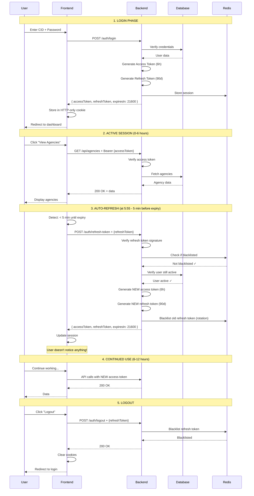
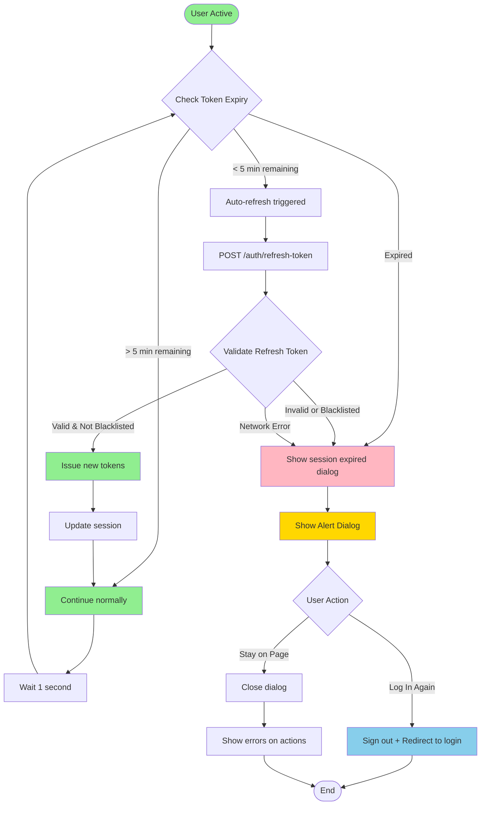
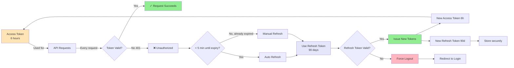
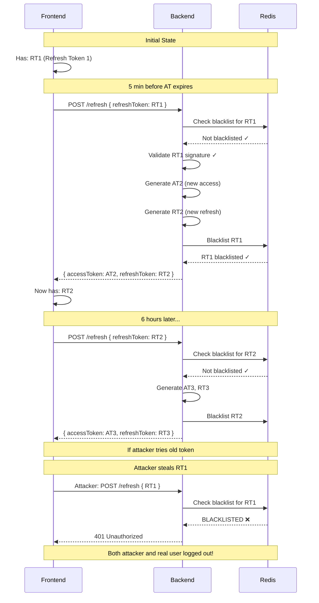
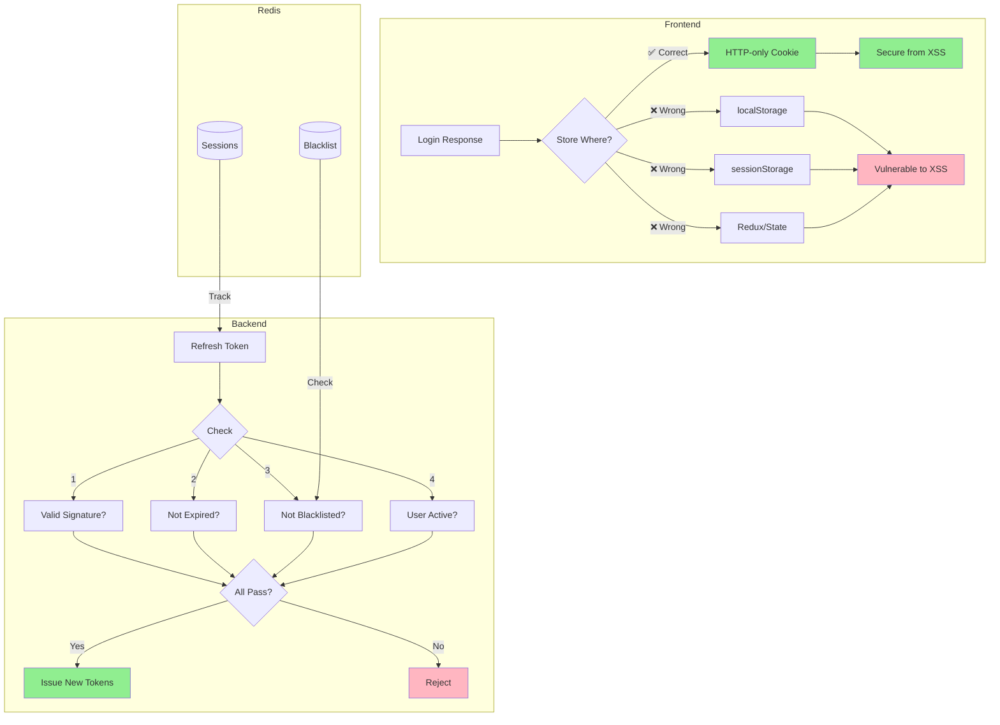
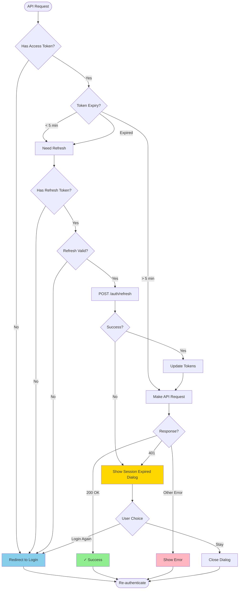

# Token & Refresh Flow Diagrams

## 🔄 Complete Token Lifecycle



## 🚨 Token Expiry Scenarios



## 🔐 Token Refresh Flow



## 🔄 Refresh Token Rotation



## 🎯 Session vs Token Expiry

```mermaid
gantt
    title Token & Session Timeline
    dateFormat X
    axisFormat %H:%M

    section Access Token
    Access Token 1 :active, at1, 0, 6h
    Refresh 1 :milestone, r1, 5h55m
    Access Token 2 :active, at2, 6h, 12h
    Refresh 2 :milestone, r2, 11h55m
    Access Token 3 :active, at3, 12h, 18h
    Refresh 3 :milestone, r3, 17h55m
    Access Token 4 :active, at4, 18h, 24h

    section Frontend Session (No Remember Me)
    Session Active :active, fs1, 0, 24h
    Session Expires :crit, fse, 24h, 24h

    section Frontend Session (Remember Me)
    Session Active :active, fs2, 0, 168h

    section Refresh Token
    Refresh Token Valid :active, rt, 0, 2160h
```

## 💾 Storage & Security



## 📱 Real-World Timeline

```mermaid
timeline
    title Your 90-Day Session Journey

    section Day 1
        8:00 AM Login : Access Token 1 : Refresh Token 1
        2:00 PM Auto-refresh : Access Token 2 : Refresh Token 2
        8:00 PM Auto-refresh : Access Token 3 : Refresh Token 3

    section Day 2
        8:00 AM Auto-refresh : Access Token 4 : Refresh Token 4
        Continue working : Seamless experience

    section Day 7
        Session continues : No re-login needed
        48 refreshes so far : All automatic

    section Day 30
        Still working : 120 refreshes so far
        No interruptions : Perfect UX

    section Day 90
        Refresh Token Expires : Must re-login
        Security maintained : Long session end
```

## 🔍 Decision Tree



---

## 📊 Key Metrics

| Metric                     | Value         | Explanation              |
| -------------------------- | ------------- | ------------------------ |
| **Access Token Lifetime**  | 6 hours       | Short for security       |
| **Refresh Token Lifetime** | 90 days       | Long for convenience     |
| **Auto-refresh Trigger**   | 5 min before  | Safety buffer            |
| **Max Refreshes**          | ~360          | 90 days ÷ 6 hours        |
| **Session Without Login**  | Up to 90 days | With valid refresh token |

## 🎯 Summary

The diagrams show:

1. **Complete flow**: From login to logout
2. **Auto-refresh**: Happens every 6 hours
3. **Token rotation**: Old tokens blacklisted for security
4. **Error handling**: Session expired dialog
5. **Storage**: HTTP-only cookies (secure)
6. **Validation**: Multi-step checks before refresh

All working together to give you a secure, seamless experience! 🎉
